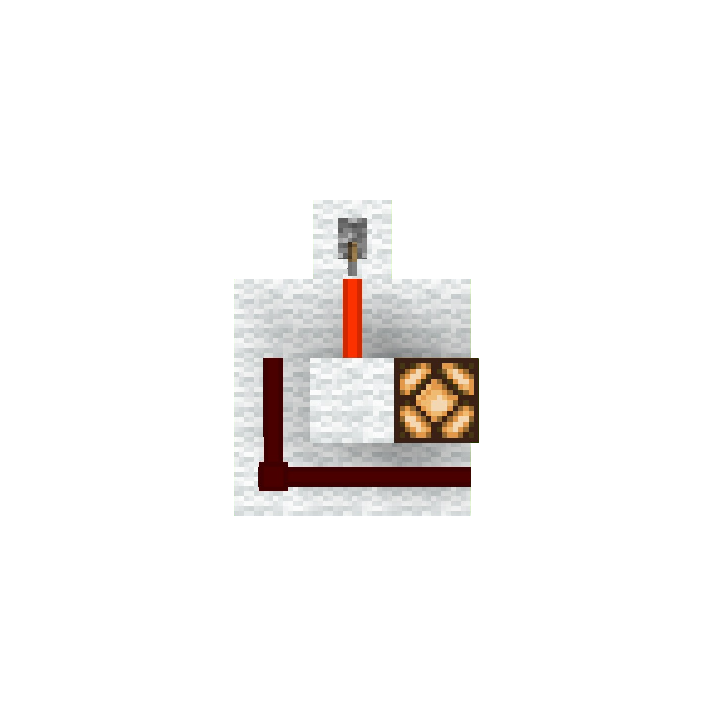

### Module 0: The Redstone Toolkit – Orientation Day (Optional)

---

#### Module Summary

-   Narrative Beat: Before we can speak to our computer, we need to learn how to hold the pen. This module equips you with the minimum viable skills in Minecraft’s Redstone so you can confidently follow along with the rest of the course.
-   Learning Goals:
    -   Identify the core components used throughout the course and understand their primary functions.
    -   Grasp the fundamental concepts of Redstone power, including signal strength and Strong vs. Weak powering.
    -   Build a simple "test rig" that combines the core components into a working circuit.
-   Lesson Overview:
    -   Lesson 0.1: The Engineer's Toolkit
    -   Lesson 0.2: How Redstone Thinks: The Rules of Power
    -   Lesson 0.3: Lab: The Fundamental Circuit
-   Minecraft Artifact: A working on/off lamp circuit using a lever, wire, and output lamp.

---

#### Module Introduction

Welcome to Redstone University’s Orientation Day!

Before we start building logic gates and registers, we need to make sure you know how to handle the tools of the trade. Think of this as our lab safety and equipment tour. Only here, the "equipment" is a mix of Redstone Dust, torches, and levers.

This is not a comprehensive Minecraft tutorial. We’re here to cover only what you need for the rest of the course: the minimum viable knowledge to confidently follow along, experiment on your own, and troubleshoot when something does not work.

If you’ve built with Redstone before, you can likely skim this. But if you’ve never placed a Redstone Torch or aren’t sure why a signal dies after 15 blocks, this short module will save you a lot of confusion later.

> #### A Note on Controls & Game Setup
> This course assumes you know the basic Minecraft controls for placing and breaking blocks. For an optimal learning experience, we highly recommend playing in **Creative Mode** on a **Superflat** world, which gives you unlimited resources and space to build.

---

#### Lesson 0.1: The Engineer's Toolkit

These are the pieces you’ll see over and over. They are the alphabet we will use to write our computer into existence.

> #### Note on Texture Packs:
> For clarity, I use a texture pack that enhances Redstone visibility (e.g., showing dust lines clearly). I highly recommend you find a similar one for your version of the game (such as "Vanilla Tweaks" or others). It makes debugging much easier.

| Component | Game Icon | Role in this Course | Description |
| :--- | :--- | :--- | :--- |
| **Redstone Dust** |  | **Wire:** The foundation of all circuits. | Carries a power signal up to 15 blocks before fading. Can be placed on most solid, opaque blocks. |
| **Redstone Torch** |  | **Power Source & Inverter (NOT Gate):** Our most versatile tool. | Acts as a constant power source. When powered by another source, it turns OFF, inverting the signal. This is our primitive **NOT gate**. |
| **Lever** |  | **Stable Input:** Our primary way to give commands. | A simple, manual on/off switch. Perfect for setting the inputs to our computer. |
| **Redstone Lamp** |  | **Output Indicator:** Lets us see the result of a calculation. | A block that lights up when powered. We use it to visualize the state of our circuits. |
| **Redstone Repeater** |  | **Signal Booster & Diode:** Essential for complex builds. | Extends a Redstone signal back to full strength (15) and acts as a one-way **diode** to prevent signals from flowing backward. |
| **Solid Block** |  | **Conductor & Insulator:** The physical structure of our machine. | A non-transparent block like Stone or Wool. It can be powered by Redstone components and transmit that power to adjacent components. |
| **Sign** |  | **Documentation:** A simple but vital tool for clarity. | Labeling your inputs, outputs, and different sections of a large build is crucial for understanding and debugging your own work. |
| **Redstone Comparator** |  | **Advanced Tool (Later Modules)** | We will introduce this component later when we build memory. For now, you just need to know it exists. |

---

#### Lesson 0.2: How Redstone Thinks: The Rules of Power

Understanding how power travels is the single most important skill for a Redstone engineer. It can be non-intuitive, so let's establish the core rules.

##### Rule 1: Signal Strength & Range
A Redstone signal has a "strength" from 15 (full power) down to 0 (off).
-   A signal source (like a Lever or Torch) outputs a signal of strength **15**.
-   For every block of Redstone Dust the signal travels, its strength decreases by **1**.
-   After 15 blocks of dust, the signal strength is 0, and the wire goes dead.
-   A **Redstone Repeater** takes any signal strength from 1 to 15 and outputs a fresh, full-strength signal of 15.

##### Rule 2: Strong vs. Weak Powering
This is a critical concept. Blocks can be powered in two ways, and what they can do depends on how they are powered.

| | **Strong Power** | **Weak Power** |
| :--- | :--- | :--- |
| **What Provides It?** | A **Lever**, **Button**, **Repeater**, or **Torch** directly powering a block. | **Redstone Dust** running into or across a block. |
| **What Can It Do?** | Powers **all** adjacent Redstone components, including dust above, below, and on all sides. | Powers only **some** adjacent components (like a lamp or repeater), but **NOT** adjacent dust. |
| **Example** |  |  |

Understanding this difference is the key to creating compact vertical circuits later in the course.

---

#### Lesson 0.3: Lab: The Fundamental Circuit

Let’s combine these concepts to build a simple input to process to output circuit. This is the core pattern of every device we’ll make, from simple gates to a full CPU.

*Figure: A Redstone Lamp with a lever (input) connected to a Redstone Lamp (output) through Redstone Dust (wire).*

1.  **Place an Output:** Place a **Redstone Lamp** on the ground.
2.  **Place an Input:** A few blocks away, place a **solid block** with a **Lever** on it. You can use any solid block, but throughout the course I will use a redstone lamp with a lever as the input. This acts as a visual indicator of the input state.
3.  **Wire them up:** Connect the block under the lever to the lamp using a line of **Redstone Dust**.
4.  **Test:** Flip the lever. The lamp should turn on and off.
5.  **Experiment:** Now, modify your circuit to test your understanding.
    -   **Invert the signal:** Insert a **Redstone Torch** somewhere in the path. How does the lamp's behavior change? (Hint: The torch acts as a NOT gate).
    -   **Extend the signal:** Make your Redstone Dust wire 20 blocks long. The signal will not reach. Now, place a **Repeater** after block 14. Observe how it refreshes the signal.

You’ve just built your first working circuit and verified the core rules of Redstone. Every single build in this course is just a more complex version of this fundamental pattern.

---

#### Module 0 Checkpoint

1.  What two essential functions does a Redstone Repeater perform?
2.  An engineer powers a block with a line of Redstone Dust. Will a piece of dust placed on top of that block receive power? Why or why not?
3.  What Redstone component is our primitive **NOT gate**?

<strong>Click for answers</strong>

1.  It boosts a signal back to strength 15 and acts as a one-way diode.
2.  No. The dust only weakly powers the block, which cannot transmit power to adjacent dust.
3.  The Redstone Torch.

#### Key Terms (Module 0)
-   **Signal Strength:** The power level of a Redstone signal, ranging from 15 (full) down to 0 (off). A signal loses 1 strength for every block of dust it travels.
-   **Power Source:** A component, like a Redstone Torch or Lever, that outputs a full-strength (15) signal.
-   **Wire:** Our term for any component, usually Redstone Dust, that transmits a signal from one point to another.
-   **Input:** A component, like a Lever, that allows a user to manually control a circuit.
-   **Output:** A component, like a Redstone Lamp, that displays the result or state of a circuit.
-   **Strong Power:** A type of power provided by components like Repeaters or Torches directly to a block. It can activate all adjacent Redstone components, including dust.
-   **Weak Power:** A type of power provided by Redstone Dust to a block. It can activate components like lamps and repeaters, but not adjacent Redstone dust.
-   **Repeater:** A component that acts as a signal booster (refreshing signal strength to 15) and a diode.
-   **Diode:** A component that allows a signal to flow in only one direction, preventing back-powering. The Redstone Repeater is our primary diode.
-   **Inverter (NOT Gate):** A circuit or component that flips a signal from ON to OFF, or OFF to ON. The Redstone Torch is our primitive inverter.
