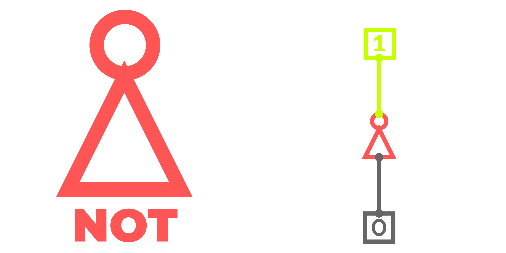
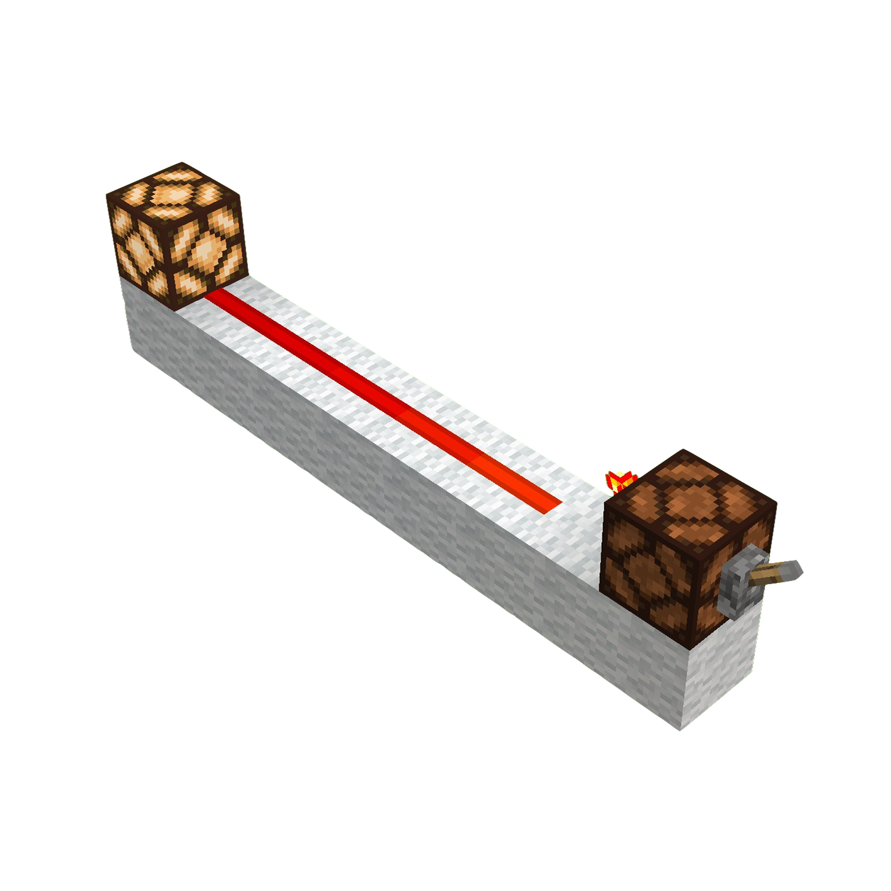
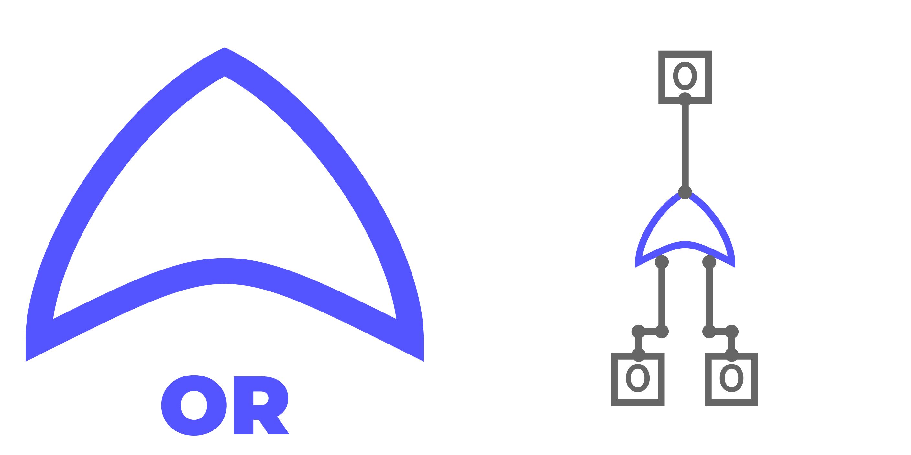
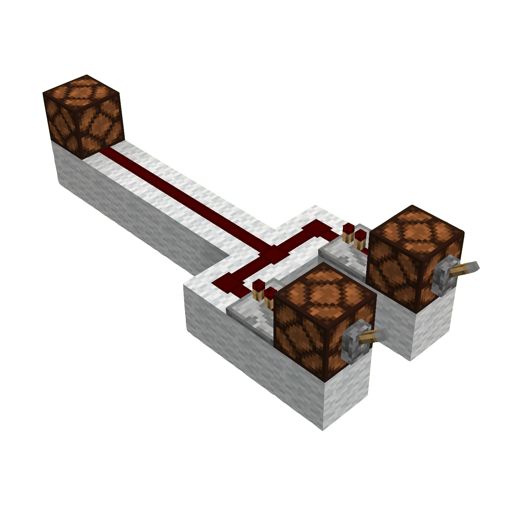
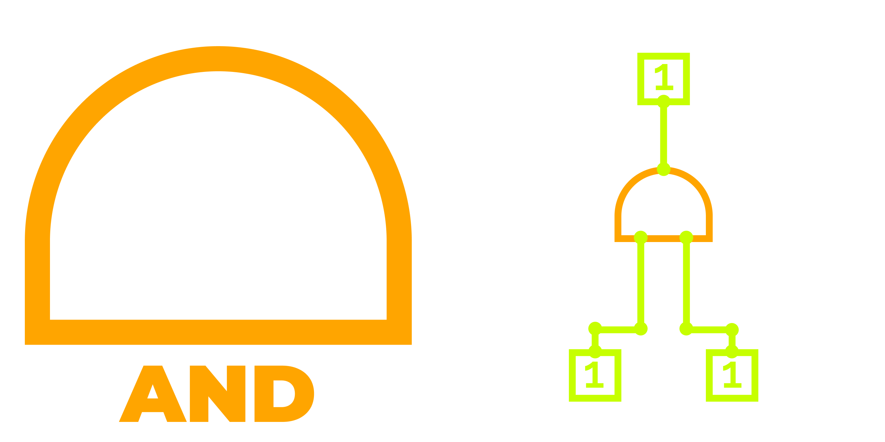
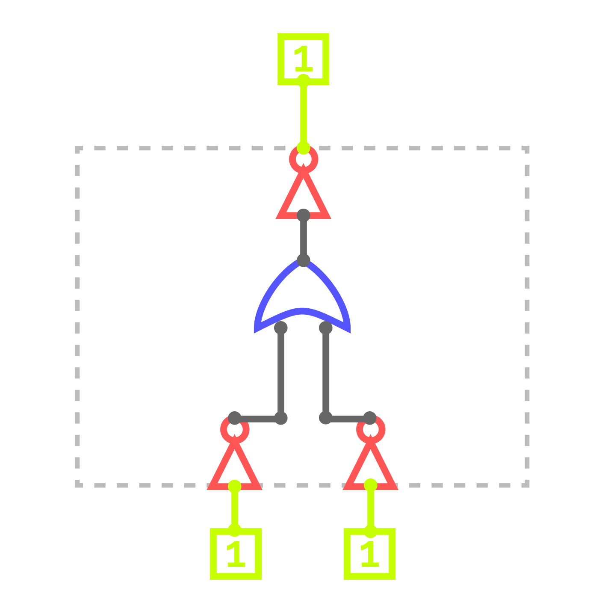
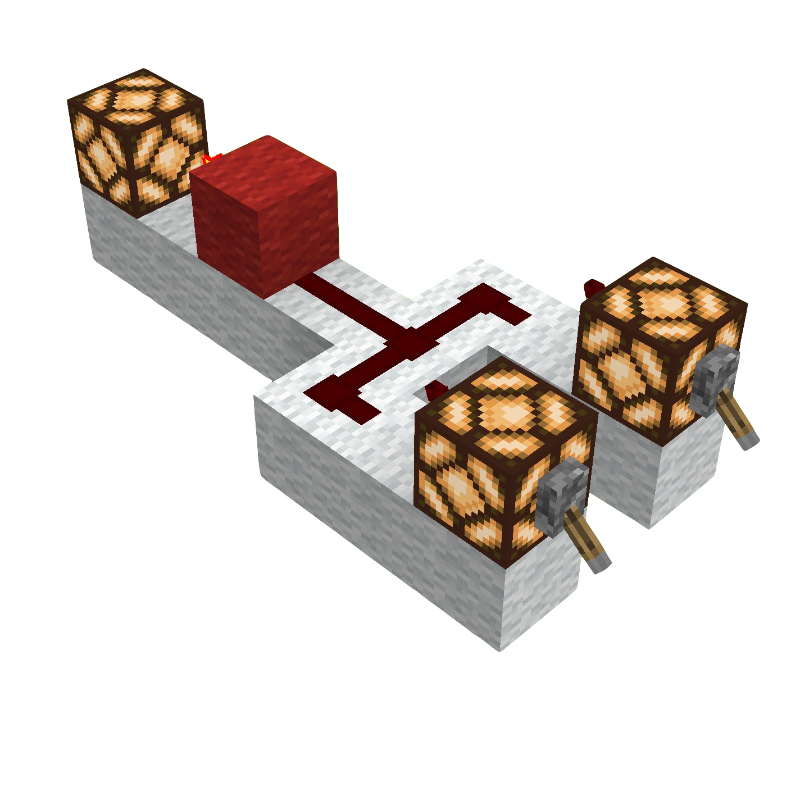

## Module 2: The Grammar of Circuits – Foundational Logic Gates

### Module 2 Summary

-   **Narrative Beat:** We have a language (binary), but no words. In this module, we'll learn the three fundamental "verbs" of logic—**NOT**, **OR**, and **AND**—that will allow our machine to form its first logical thoughts.
-   **Learning Goals:**
    -   Understand the role of Minecraft's primitive logic gates (NOT and OR).
    -   Master the concept of a truth table as the ultimate "source of truth" for a gate's function.
    -   Build a composite gate (AND) by combining primitives, a core skill in digital engineering.
-   **Lesson Overview:**
    -   Lesson 2.1: The Rules of Thought
    -   Lesson 2.2: The Primitives – Building NOT and OR Gates
    -   Lesson 2.3: The First Composite Gate – Building an AND Gate
-   **Minecraft Artifact:** A working set of the three foundational logic gates: NOT, OR, and AND.

---

### Module 2 Introduction

Welcome back to Redstone University!

In our last module, we built an interface to speak to our computer in its native language: binary. But sending signals is only half the story. To make our machine *think*, we need to teach it how to understand those signals. We need to give it a grammar.

This module is our first deep dive into the theory that powers every digital device ever made. We will learn about **Boolean Algebra**, the elegant mathematics of True and False. Then, we will immediately bring that theory to life by building the three most fundamental "verbs" of logic: the **NOT**, **OR**, and **AND** gates.

By the end of this module, you won't just have a collection of circuits; you'll understand the foundational principles that allow simple on/off signals to become the building blocks of complex decisions.

---

### Lesson 2.1: The Rules of Thought

> **Key Takeaway:** Boolean algebra gives us a precise mathematical language for describing and manipulating the True/False states of digital circuits.

In the mid-1800s, a mathematician named George Boole developed a new kind of algebra. Unlike the algebra you're used to, where variables like $x$ and $y$ can be any number, Boole's variables were much simpler. They could only have two possible values: **True** or **False**.

This system, now called **Boolean Algebra**, was initially a mathematical curiosity. But a century later, when engineers started building the first electronic computers with on/off switches, they realized Boole had already invented the perfect system to describe them. In the abstract world of math, these values are the constants $1$ (True) and $0$ (False). In the physical world of our circuits, they are the literal signals `1` (ON) and `0` (OFF).

-   **The Core Idea:** We will treat our Redstone signals as Boolean variables, like $A$ or $B$.
-   A powered Redstone line has the physical value **True** (`1`).
-   An unpowered Redstone line has the physical value **False** (`0`).

Boolean algebra gives us a set of rules and operators to manipulate these variables. When we build those operators physically, we call them **logic gates**, and they are the bedrock (pun intended) of all computation.

---

### Lesson 2.2: The Primitives – Building NOT and OR Gates

Every complex machine is built from simple, fundamental parts. In digital logic, these parts are called **primitive gates**. In the world of computer science, you can build any logic gate from a small set of these primitives. For this course, our primitives are dictated by the very mechanics of Minecraft itself, giving us two logical operations right out of the box:

1.  **NOT:** A Redstone Torch naturally inverts a signal. This is our primitive NOT gate.
2.  **OR:** Redstone Dust naturally merges signals. If any line powering a central wire is ON, the whole wire becomes ON. This is our primitive OR gate.

From these two building blocks, **NOT** and **OR**, we will construct every other logic gate in our computer. This approach shows you how even the most complex digital machines can be built from the simplest possible parts. While real-world electronics often use gates like NAND or NOR as universal primitives for manufacturing efficiency, we will stick with NOT and OR because they are so intuitive and map directly to the Redstone system.

Now, let's build them.

---

#### How We Describe Each Gate

To ensure a complete understanding, every logic gate in this course is introduced using a consistent structure. Think of this as the blueprint for each of our investigations.

**Visual Introduction:**

-   **Abstract Symbol & Function:** We begin with an image showing the gate's standard engineering symbol alongside a simple circuit demonstrating its basic function.
-   **Composite Diagram (For Composite Gates Only):** For gates built from our primitives, we then show a detailed CircuitVerse diagram of how they are constructed using only NOT and OR gates.
-   **Minecraft Build:** Finally, we show a screenshot of the gate built in Minecraft, reflecting our "primitives-only" design philosophy.

**Formal Definition & Rules:**

-   **Formal Definition:** The high-level concept and official terminology (e.g., "Conjunction").
-   **Symbols:** Common ways the operator is written in logic ($A \land B$) and programming (`A && B`).
-   **The Rule:** A plain-English sentence describing what the gate does.
-   **Truth Table:** A complete chart defining all possible input/output combinations. This is the ultimate "source of truth."
-   **Primitive Boolean Expression:** The specific algebraic expression that represents our composite build using only **NOT** and **OR**.

**Practical Application:**

-   **Lab & Experiment:** A hands-on test to verify your Minecraft build against the gate's truth table.
-   **Real-World Connection:** An example of where this logic is used in real technology.
-   **Software Connection:** An example of how the logical operator is used in a programming context.

---

#### Operator 1: NOT (The Inverter) - A Minecraft Primitive

> **Key Takeaway:** The NOT gate flips a single input, turning a `1` to a `0` or a `0` to a `1`. It's the logical equivalent of the word "opposite."

*Figure: The abstract symbol for the NOT gate (left) and its function in a basic circuit (right), taking a single input $A$ and producing an inverted output $Y$.*

-   **Formal Definition:** The NOT gate, or **Inverter**, performs logical **Negation**. It takes one input and outputs its exact opposite.
-   **Symbols:** $\text{NOT } A$ ($\neg A$), `!A` (programming).
-   **The Rule:** If the input is True, the output is False. If the input is False, the output is True.
-   **Truth Table: NOT Gate**
| $A$ | $\neg A$ |
|:---:|:----:|
| `0` | `1` |
| `1` | `0` |
-   **The Boolean Expression:** The output $Y$ is simply $Y = \neg A$.

##### Lab & Experiment

*Figure: A NOT gate in Minecraft using a Redstone Torch. The torch inverts the input, turning the lamp on when the lever is off and vice versa. This is the simplest physical realization of logical negation.*

1.  **Build the circuit:**
    1.  Place a solid block with a Lever on it for input $A$. Using a Redstone Lamp as the solid block here provides a helpful visual indicator.
    2.  Attach a **Redstone Torch** to the side or back of the block. This torch *is* the NOT gate.
    3.  Run Redstone Dust from the torch to a Redstone Lamp for output $Y$.
2.  **Test the circuit:**
    -   Set lever $A$ to ON (`1`). Observe that the output lamp is OFF (`0`).
    -   Set lever $A$ to OFF (`0`). Observe that the output lamp is ON (`1`).
3.  **Verification:** The physical results perfectly match the truth table. You've built a working inverter!

##### Real-World & Software Connection

NOT logic is everywhere. It's used to create the oscillating signal in a computer's clock (its "heartbeat") and is crucial for representing negative numbers. In programming, the `not` keyword (or `!`) inverts a condition, just like our torch: `if not is_ready: ...`.

---

#### Operator 2: OR (The "At Least One" Gate) - A Minecraft Primitive

> **Key Takeaway:** The OR gate outputs a `1` if **at least one** of its inputs is a `1`. It’s how we express "either/or" conditions.

*Figure: The abstract symbol for the OR gate (left) and its function in a circuit (right). The output $Y$ is active if input $A$, $B$, or both are active.*

-   **Formal Definition:** The OR gate performs logical **Disjunction**. Think of it as the optimisitc gate; it checks if *any* of its inputs are True.
-   **Symbols:** $A \text{ OR } B$ ($A \lor B$), `A || B` (programming).
-   **The Rule:** The output is True if $A$ is True, OR $B$ is True, or if both are True.
-   **Truth Table: OR Gate**

| $A$ | $B$ | $A \lor B$ |
|:---:|:---:|:--------:|
| `0` | `0` | `0` |
| `0` | `1` | `1` |
| `1` | `0` | `1` |
| `1` | `1` | `1` |

-   **The Boolean Expression:** The output $Y$ is $Y = A \lor B$.

##### Lab & Experiment

*Figure: A Minecraft OR gate built by merging two Redstone Dust lines. The output lamp lights up if either lever is on, demonstrating "at least one" logic.*

1.  **Build the circuit:**
    1.  Place two input blocks (e.g., Redstone Lamps with Levers) for $A$ and $B$, leaving a space between them.
    2.  Place a **Redstone Repeater** facing away from the back of each input block. This acts as a diode, preventing signals from flowing backward.
    3.  Run **Redstone Dust** from each repeater and merge them into a single output line. This merger *is* the OR gate.
    4.  Connect this output line to a Redstone Lamp for $Y$.

    > **Engineering Note: What is a diode?**
    > In electronics, a **diode** is a component that allows a signal to flow in only one direction, like a one-way valve or a turnstile for electricity. This property is essential for preventing signals from going where they aren't supposed to.
    >
    > In our OR gate, if we merge the dust lines directly, a signal from input $A$ could travel backwards up the other wire and power input $B$'s lamp, even if $B$'s lever is off. This is called "back-powering."
    >
    > The **Redstone Repeater** is a perfect, purpose-built diode in Minecraft. Notice the small arrow on top of it; it will only allow a signal to pass in that direction. By placing a repeater on each input line, we ensure the signal can flow *out* towards the final lamp, but cannot flow *backwards* to interfere with the other input.

2.  **Test the circuit:** Verify all four combinations from the truth table (`00`, `01`, `10`, `11`) and confirm the output lamp behaves as expected.

##### Real-World & Software Connection

OR logic is used for monitoring multiple conditions. A car's dashboard might light up if the `LeftDoorOpen` is true OR the `RightDoorOpen` is true. In programming, the `||` operator achieves this, allowing a block of code to run if any one of several conditions is met.

#### Practice Problem 2.2.1: Boolean Expression Evaluation

Given the Boolean expression $A \text{ OR } (\text{NOT } B)$ ($A \lor (\neg B)$), evaluate the output for all possible input combinations and create a truth table. Then, build a Minecraft circuit to verify your results.

<strong>Show Solution</strong>

**Truth Table for $A \lor (\neg B)$:**

| $A$ | $B$ | $\neg B$ | $A \lor (\neg B)$ |
|:---:|:---:|:---:|:---:|
| `0` | `0` | `1` | `1` |
| `0` | `1` | `0` | `0` |
| `1` | `0` | `1` | `1` |
| `1` | `1` | `0` | `1` |

**Minecraft Circuit**: Use a lever for input $A$ and another for input $B$. Place a Redstone Torch on the output line of $B$ to create the signal for $\neg B$. Merge the signal from $A$ and the signal from $\neg B$ using Redstone Dust (an OR gate). Connect the final output to a lamp and test all combinations to verify.

---

### Lesson 2.3: The First Composite Gate – Building an AND Gate

> **Key Takeaway:** An AND gate outputs a `1` only if **all** of its inputs are a `1`. We will construct this new function by cleverly combining our primitive NOT and OR gates.

*Figure: The abstract symbol for the AND gate (left) and its function. The output $Y$ is active only if both $A$ and $B$ are active.*

Now we reach a pivotal moment. Minecraft doesn't give us a single block that performs the AND operation. We must build it ourselves from the parts we already have. This is the essence of digital engineering: creating complex functions from simple components.

To connect the abstract concept of a gate to our physical build, we will use a consistent visual format. Each composite gate will be introduced with its standard, abstract symbol, which is how engineers represent it in high-level diagrams. This will be followed by a detailed composite diagram showing how to construct it from our primitive NOT and OR gates. In these diagrams, a dashed outline will enclose the group of primitives, visually demonstrating how they work together to become equivalent to the single, abstract gate.

*Figure: The AND gate constructed from our primitives. This diagram shows how two NOT gates and one OR gate are combined to create the AND function.*

-   **Formal Definition:** The AND gate performs logical **Conjunction**. It is the strict gate; its output is True only if *all* inputs are True.
-   **Symbols:** $A \text{ AND } B$ ($A \land B$), `A && B` (programming).
-   **The Rule:** The output is True only if $A$ is True AND $B$ is True.
-   **Truth Table: AND Gate**

| $A$ | $B$ | $A \land B$ |
|:---:|:---:|:---------:|
| `0` | `0` | `0` |
| `0` | `1` | `0` |
| `1` | `0` | `0` |
| `1` | `1` | `1` |

-   **The Boolean Expression:** The output $Y$ is described by the expression $Y = A \land B$. We will achieve this with the composite expression $\text{NOT}(\text{NOT } A \text{ OR } \text{NOT } B)$ ($\neg(\neg A \lor \neg B)$), a clever trick we'll explore in the next module.

---

#### Lab & Experiment

*Figure: A composite AND gate in Minecraft. This build physically demonstrates how to achieve AND logic using only Redstone Torches (NOTs) and Dust (OR).*

> **Note on Screenshots and Color Coding:**
> Our Minecraft circuit screenshots use a pseudo-isometric view to show as much of the build as possible. However, it can sometimes be hard to tell if a redstone torch is attached to the backside of a block. To make this clear, any block with a torch on its backside is colored red in the screenshot. Blocks with torches only on top are easy to see, so they use the build’s default color unless they also have a backside torch, in which case they’re red. For redstone lamps used as inputs (with a lever on one side and a torch or repeater on the other), we can't color code them obviously, but the instructions clearly indicate when a torch is on the backside of one of these input blocks.

1.  **Build the circuit:**
    1.  Create two inputs, $A$ and $B$, using Levers on Redstone Lamps.
    2.  Attach a Redstone Torch to the back of each input block. These are your two **NOT** gates, creating the signals for $\neg A$ and $\neg B$.
    3.  Run Redstone Dust from both torches so they merge at a central point. This is your **OR** gate, which implements $\neg A \lor \neg B$.
    4.  Run this merged dust line into a solid block.
    5.  Attach one final Redstone Torch to the front of that block. This is your final **NOT** gate, which inverts the entire expression.
    6.  Connect this final torch to an output lamp for $Y$.
2.  **Test the circuit:** Cycle through all four input combinations. You will find the output lamp turns on only when both lever $A$ AND lever $B$ are ON.

#### Real-World & Software Connection

AND logic is essential for safety and precision. A missile might require `TurnKey1` is true AND `PressButton` is true to launch. In programming, the `&&` operator is used to ensure multiple conditions are met before executing a critical piece of code.

#### Practice Problem 2.3.1: Logic Gate Design Challenge

Design a circuit that implements the logic $A \text{ AND } (\text{NOT } B)$ ($A \land (\neg B)$) using only the NOT and OR primitives. Build it in Minecraft and verify with a truth table for all input combinations ($A$, $B$ = `0,0`; `0,1`; `1,0`; `1,1`).

<strong>Show Solution</strong>

**Truth Table for $A \land (\neg B)$:**

| $A$ | $B$ | $\neg B$ | $A \land (\neg B)$ |
|:---:|:---:|:---:|:----------:|
| `0` | `0` | `1` | `0` |
| `0` | `1` | `0` | `0` |
| `1` | `0` | `1` | `1` |
| `1` | `1` | `0` | `0` |

**Boolean Expression**: The expression $A \land (\neg B)$ is equivalent to $\text{NOT}(\text{NOT } A \text{ OR } B)$ ($\neg(\neg A \lor B)$) by De Morgan’s Law.

**Minecraft Circuit**: Invert $A$ to get the signal for $\neg A$. Then, take that $\neg A$ signal and the original $B$ signal and feed them into an OR gate. Finally, invert the result of that OR gate with a final NOT gate.

---

### Module 2 Checkpoint

#### Practice Problem 2.4.1: Knowledge Check

1.  What are the two "primitive" logic gates that Minecraft provides directly through its game mechanics?
2.  What is the primary purpose of a truth table?
3.  What is the key difference in the rule for an OR gate versus an AND gate?

<strong>Show Solution</strong>

1.  The **NOT** gate (a Redstone Torch) and the **OR** gate (merging Redstone Dust lines).
2.  A truth table's purpose is to define a gate's behavior for every possible combination of inputs. It is the ultimate source of truth for how a logic circuit functions.
3.  An **OR** gate outputs a `1` if *at least one* input is a `1`. An **AND** gate outputs a `1` only if *all* inputs are a `1`.

#### Practice Problem 2.4.2: The Word Problem

A simple home security system should sound an alarm ($Y$) if the front door is opened ($A$) **OR** the back door is opened ($B$), but only when the system is armed ($C$).

Write the single Boolean expression for the alarm $Y$. Which gates would you need to build this?

<strong>Show Solution</strong>

**Boolean Expression:** $Y = (A \lor B) \land C$

**Logic Gates Needed:** You would need one **OR** gate to combine the door sensors ($A \lor B$) and one **AND** gate to check if that result is true AND the system is armed ($C$).

#### Practice Problem 2.4.3: The Build Challenge

Design and build a Minecraft circuit that implements the logic $A \text{ AND } (\text{NOT } B)$ ($A \land (\neg B)$). Use only the primitive NOT and OR gates. Verify its function against a truth table for all four input combinations.

<strong>Show Solution</strong>

**Truth Table:**

| $A$ | $B$ | $\neg B$| $A \land (\neg B)$ |
|:---:|:---:|:---:|:----------:|
| `0` | `0` | `1` | `0` |
| `0` | `1` | `0` | `0` |
| `1` | `0` | `1` | `1` |
| `1` | `1` | `0` | `0` |

**Minecraft Circuit:**
1.  Create inputs for $A$ and $B$.
2.  Use a Redstone Torch on the $B$ input line to create the signal for $\neg B$.
3.  Feed the original $A$ signal and the new $\neg B$ signal into a composite **AND** gate (built from two NOTs and an OR, as shown in Lesson 2.3).
4.  Connect the output to a lamp and test all four states.

#### Key Terms

-   **Boolean Algebra**: A branch of mathematics for working with true/false values ($1$/$0$), using operators like AND, OR, and NOT.
-   **Composite Gate**: A logic gate that is constructed by combining primitive gates (e.g., an AND gate built from NOT and OR gates).
-   **Diode**: A component that allows a signal to pass in only one direction. In Minecraft, the Redstone Repeater acts as a perfect diode.
-   **Logic Gate**: A physical device that performs a Boolean logic operation on one or more inputs to produce a single output.
-   **Primitive Gate**: A basic, indivisible logic gate from which more complex gates are built. In our course, these are NOT and OR.
-   **Truth Table**: A chart showing every possible input combination for a logic circuit and its corresponding output.

---

### Module 2 Conclusion

Huzzah! You've successfully taken your first steps into the world of digital logic. You started with the abstract idea of Boolean Algebra and ended by building physical, working circuits that obey its laws. You now understand the three foundational gates—NOT, OR, and AND—and have experienced the core engineering principle of building complex components from simpler ones.

You have built the essential "verbs" of our computer's language. In the next module, **The Art of Logic**, we will expand our vocabulary with more specialized gates and learn the powerful techniques of simplification that allow engineers to design circuits that are not only correct, but also elegant and efficient.
