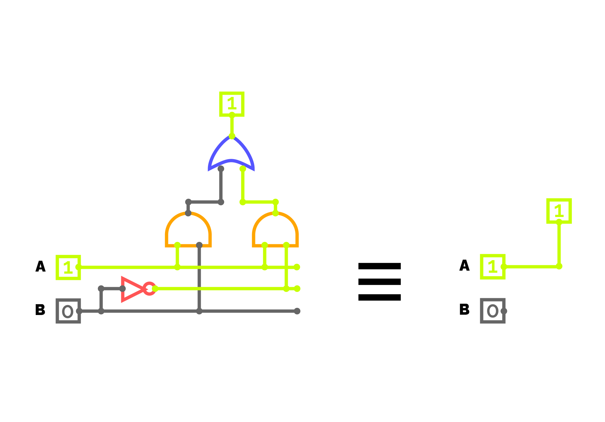
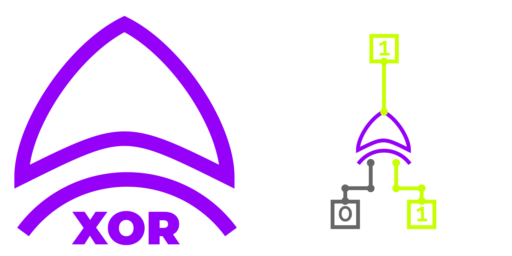
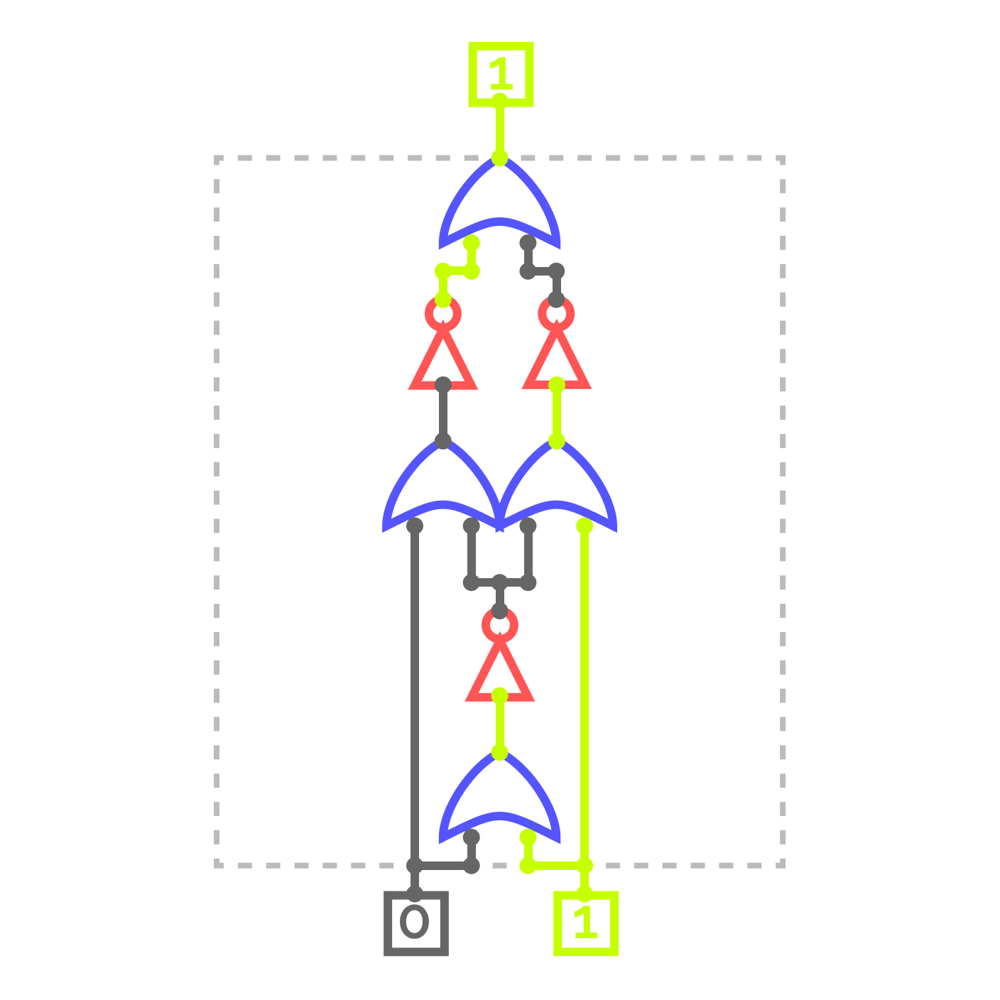
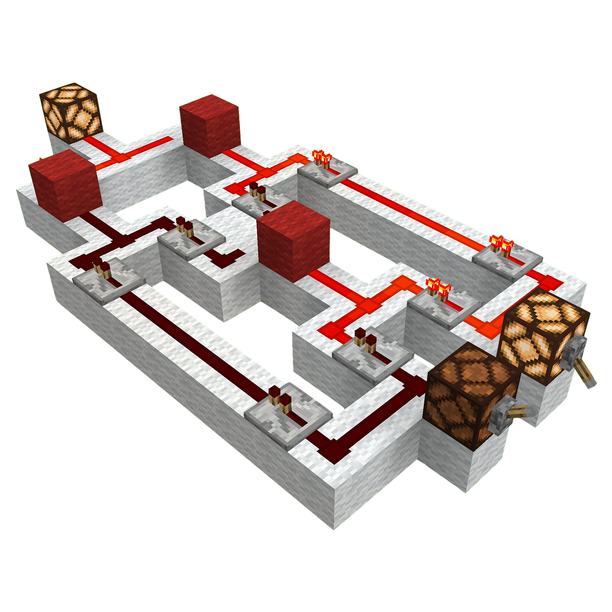
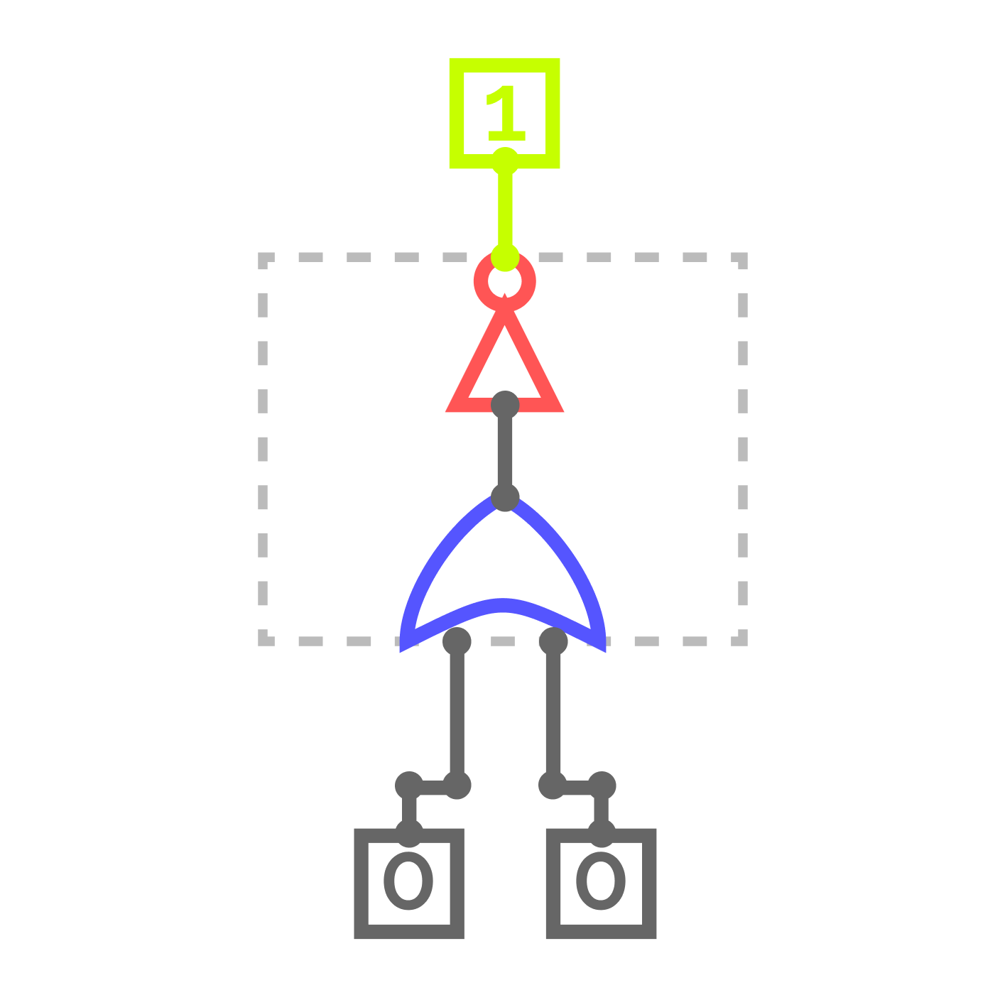
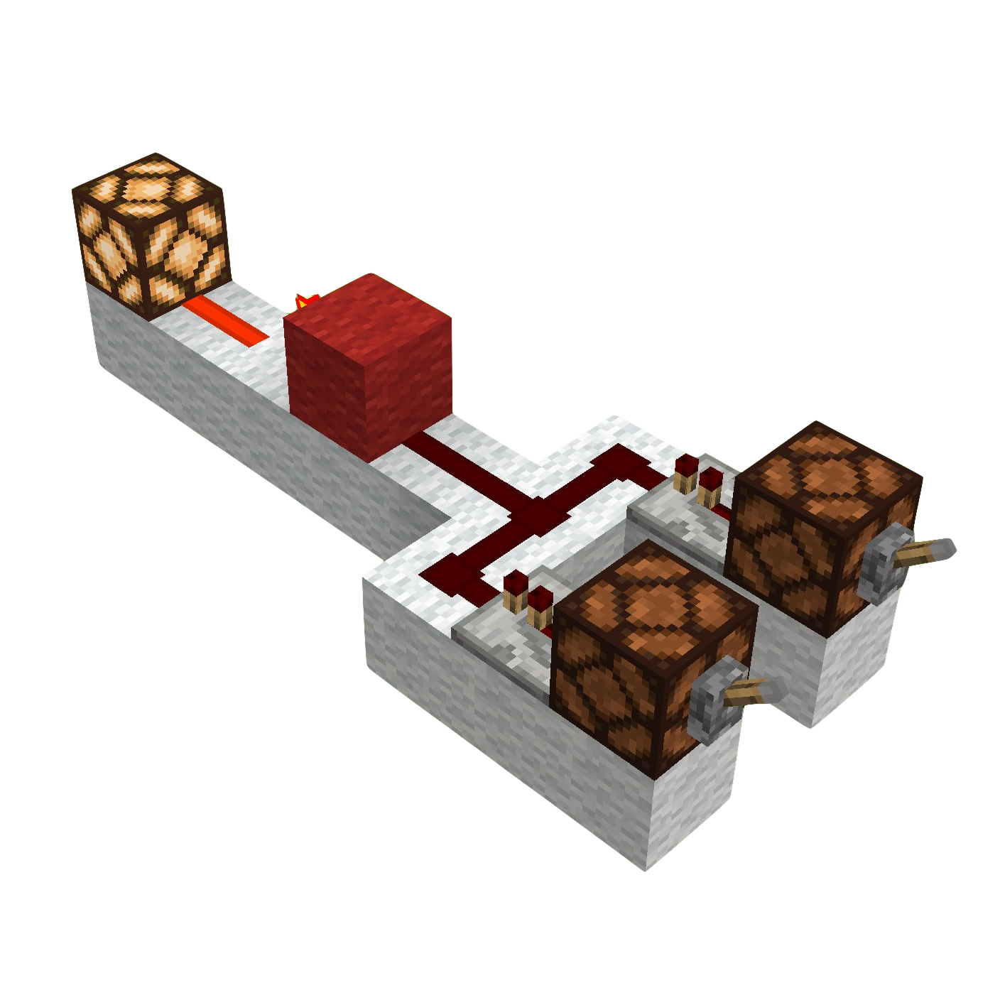
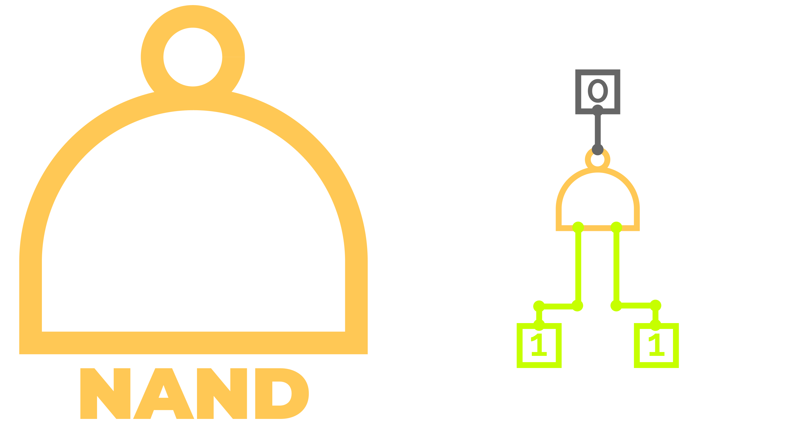
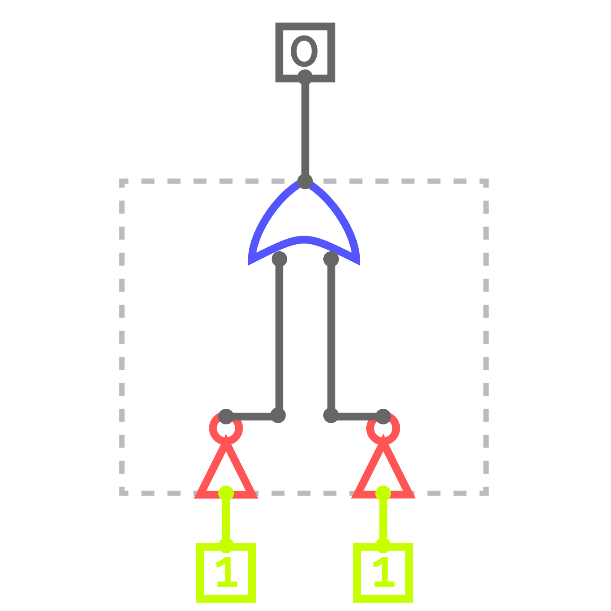
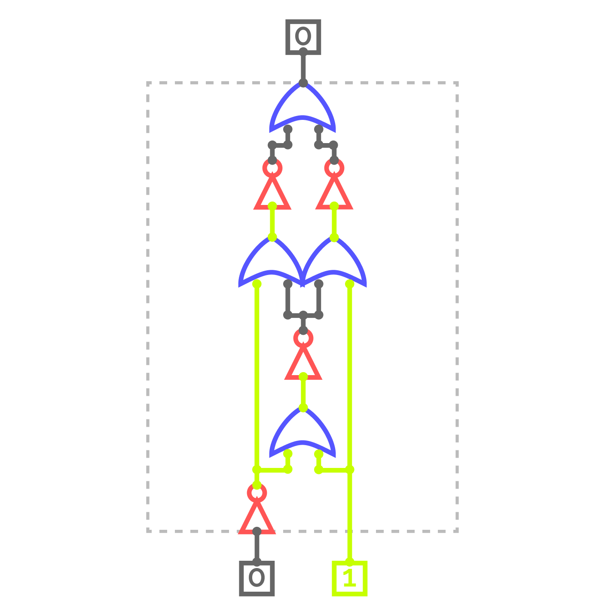
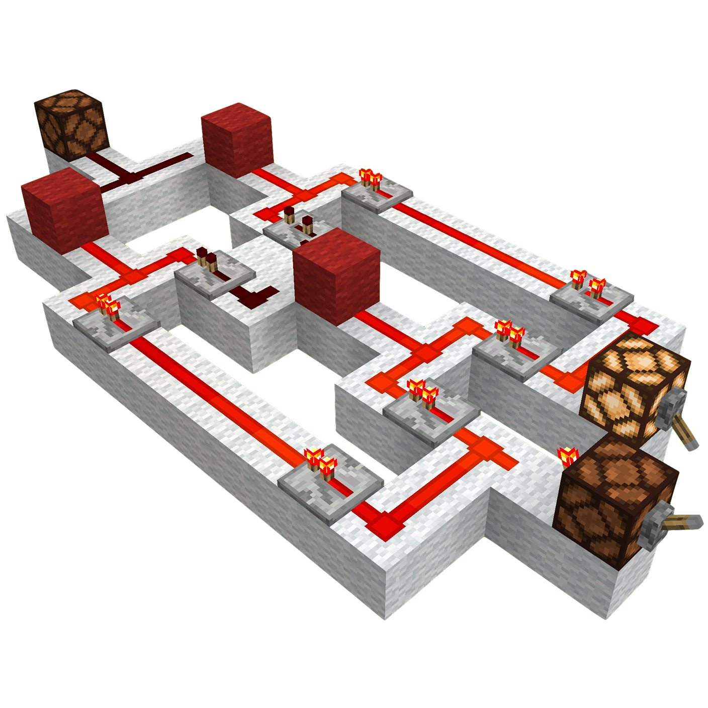

## Module 3: The Art of Logic – Simplification and Special Gates

### Module 3 Summary

-   **Narrative Beat:** We know the basic words. Now, we learn to write poetry. How can we say the same thing with fewer words (Simplification)? And what are the special "adjectives" and "conjunctions" (XOR, NAND) that allow for more elegant and powerful expressions?
-   **Learning Goals:**
    -   Apply the laws of Boolean algebra to simplify circuits on paper, making them more efficient.
    -   Build and understand the unique properties of the XOR, NAND, and NOR gates.
    -   Grasp the concept of universal gates (functional completeness).
    -   Connect hardware logic to clever software algorithms (the XOR trick).
-   **Lesson Overview:**
    -   Lesson 3.1: The Laws of Logic & The Power of Simplification
    -   Lesson 3.2: The Special Operator – Building an XOR Gate
    -   Lesson 3.3: Software Superpowers – The XOR Trick for Programmers
    -   Lesson 3.4: The Negated Gates – NAND, NOR, and XNOR
-   **Minecraft Artifact:** A working set of the advanced logic gates (XOR, NAND, NOR, XNOR) and a completed, simplified circuit from a practice problem.

---

### Module 3 Introduction

You've mastered the foundational logic gates, the basic "verbs" of our computer's language. But a true engineer doesn't just build circuits that function; they build them with **efficiency** and **elegance**.

Welcome to the art of logic.

In this module, we move from simple sentences to poetry. First, you'll learn the powerful laws of Boolean algebra that allow us to simplify complex expressions, transforming a bulky, slow circuit into one that is small, fast, and optimized. Then, we'll expand our logical toolkit with more advanced gates: from the versatile **comparison gates**, XOR and XNOR, to the powerful **universal gates**, NAND and NOR, which unlock completely new ways of solving problems.

This is where you transition from being a builder to being an **architect**. Let's learn to build not just correctly, but with foresight and efficiency.

---

### Lesson 3.1: The Laws of Logic & The Power of Simplification

> **Key Takeaway:** Boolean laws are like mathematical shortcuts that let us simplify complex circuits, making our designs smaller, faster, and more efficient.

Just like $2 + x = x + 2$ in normal algebra, Boolean algebra has laws that let us rearrange and simplify expressions. For us, **a simpler expression means a smaller, faster, and more reliable Redstone circuit.** This is a critical engineering skill.

#### A Note on Notation

You’ll often see logic written using symbols from regular math. For example, **AND** is sometimes written as multiplication ($A \cdot B$ or $AB$), **OR** as addition ($A + B$), and **NOT** as an overbar ($Ā$).

For this course, we will continue using the "dual notation" system we introduced in Module 2. We lead with a text-based version for clarity, followed by the formal symbol in parentheses. This makes the concepts both intuitive for beginners and academically sound. For example: $A \text{ AND } B$ ($A \land B$).

#### The Laws of Boolean Algebra

Here are the key laws we will be using in our course. Mastering them is the first step to designing elegant circuits.

-   **Identity Law:** $A \lor 0 = A$ and $A \land 1 = A$.
-   **Annihilator Law:** $A \lor 1 = 1$ and $A \land 0 = 0$.
-   **De Morgan's Law:** This is the superstar. It gives us a powerful way to convert between AND and OR logic.
    -   $\text{NOT}(A \text{ AND } B)$ ($\neg(A \land B)$) is the same as $(\text{NOT } A) \text{ OR } (\text{NOT } B)$ ($\neg A \lor \neg B$).
    -   $\text{NOT}(A \text{ OR } B)$ ($\neg(A \lor B)$) is the same as $(\text{NOT } A) \text{ AND } (\text{NOT } B)$ ($\neg A \land \neg B$).

---

#### Lab 1: Proving a Circuit with De Morgan's Law

Let's use De Morgan’s Law to prove that our composite AND gate from Module 2 is logically correct. This is a practical application of how theory can verify our hands-on work.

1.  Our build consisted of two initial NOT gates on inputs $A$ and $B$, giving us the signals $\neg A$ and $\neg B$.
2.  Their signals merged in an OR gate, resulting in the expression $\neg A \lor \neg B$.
3.  A final NOT gate inverted that result. Therefore, the full expression for our circuit is $\neg(\neg A \lor \neg B)$.
4.  According to De Morgan’s Law, the part in the parentheses, $\neg A \lor \neg B$, is identical to $\neg(A \land B)$.
5.  Substituting that back in, our full expression becomes $\neg(\neg(A \land B))$.
6.  The two NOTs ($\neg\neg$) cancel each other out, leaving $A \land B$. We've just proven our physical circuit is a perfect AND gate!

#### Lab 2: Simplifying a Circuit with the Distributive Law

The laws of logic don't just prove a circuit is correct; they make our circuits *more efficient*. This is a crucial engineering skill called **simplification**.

Consider a circuit that needs to turn on if ($A$ is ON and $B$ is ON) OR if ($A$ is ON and $B$ is OFF). The direct Boolean expression would be:

$Y = (A \text{ AND } B) \text{ OR } (A \text{ AND } (\text{NOT } B))$ ($Y = (A \land B) \lor (A \land (\neg B))$)

This looks like it would require two AND gates and one OR gate. Let's simplify it.

1.  **Start with the expression:** $Y = (A \land B) \lor (A \land (\neg B))$
2.  **Apply the Distributive Law:** Notice that $A \land$ is common to both terms. We can "factor it out."
    *   This gives us: $Y = A \land (B \lor \neg B)$
3.  **Apply the Inverse Law:** We know that an input OR'd with its own inverse ($B \lor \neg B$) is always equal to the constant $1$ (True).
    *   The expression becomes: $Y = A \land 1$
4.  **Apply the Identity Law:** We know that any input AND'd with $1$ is just itself.
    *   The final expression is: $Y = A$

**Lab Takeaway:** We have just proven that this entire three-gate circuit can be replaced by a single wire connected to input $A$. This is the power of simplification in action. It saves resources, space, and makes our designs more elegant.


*Figure: The circuit for $Y = (A \land B) \lor (A \land \neg B)$ before simplification (left) and after (right). Both are functionally identical.*

#### Summary Table: Boolean Laws

| Law Name | Example(s) | Description |
|---|---|---|
| Identity | $A \lor 0 = A$<br>$A \land 1 = A$ | Leaves value unchanged |
| Annihilator | $A \lor 1 = 1$<br>$A \land 0 = 0$ | Output is always $1$ (OR) or $0$ (AND) |
| Idempotent | $A \lor A = A$<br>$A \land A = A$ | Repeating input doesn't change output |
| Inverse | $A \lor \neg A = 1$<br>$A \land \neg A = 0$ | Input and its inverse always produce $1$ (OR) or $0$ (AND)|
| Commutative | $A \lor B = B \lor A$<br>$A \land B = B \land A$ | Order doesn't matter |
| Associative | $(A \lor B) \lor C = A \lor (B \lor C)$<br>$(A \land B) \land C = A \land (B \land C)$ | Grouping doesn't matter |
| Distributive | $A \land (B \lor C) = (A \land B) \lor (A \land C)$ <br>$A \lor (B \land C) = (A \lor B) \land (A \lor C)$ | AND distributes over OR, OR distributes over AND |
| De Morgan's Laws | $\neg(A \land B) = \neg A \lor \neg B$<br>$\neg(A \lor B) = \neg A \land \neg B$ | Converts between AND/OR with inversion |

> **A Special Note on the Distributive Law:**
> Notice that Boolean algebra has two distributive laws. The first one, $A \land (B \lor C)$, looks very similar to the distributive law in regular algebra. However, the second one, $A \lor (B \land C)$, is unique to Boolean logic. In the algebra you're used to, $a + (b \cdot c)$ does NOT equal $(a + b) \cdot (a + c)$. This unique property of duality is one of the things that makes Boolean algebra so powerful for simplifying digital circuits.

#### Practice Problem 3.1.1: Circuit Simplification Challenge

Given the expression $(A \text{ OR } B) \text{ AND } (\text{NOT } A \text{ OR } \text{NOT } B)$ ($(A \lor B) \land (\neg A \lor \neg B)$), simplify it using Boolean laws. Show all steps.

<details>
<summary><strong>Show Solution</strong></summary>

**Simplification Steps:**
1.  **Start with the expression:** $(A \lor B) \land (\neg A \lor \neg B)$
2.  **Apply De Morgan’s Law to the second term:** $(\neg A \lor \neg B)$ is equivalent to $\neg(A \land B)$.
3.  **The expression becomes:** $(A \lor B) \land \neg(A \land B)$
4.  **This expression is the definition of Exclusive OR (XOR):** This logic reads as "(A or B is true) AND (they are not both true)."
5.  **Final simplified expression:** $A \text{ XOR } B$ ($A \oplus B$)

</details>

---

### Lesson 3.2: The Special Operator – Building an XOR Gate

> **Key Takeaway:** The **XOR** (Exclusive OR) gate outputs a `1` only when its inputs are **different**. It’s the heart of binary addition and a powerful tool for programming.


*Figure: The abstract symbol for the Exclusive OR (XOR) gate (left) and its function, producing an output $Y$ that is active only if inputs $A$ and $B$ are different.*

Like the AND gate, XOR is a composite gate we must build from our primitives.


*Figure: The XOR gate constructed in CircuitVerse using only OR and NOT gates. This composite design shows how the XOR function can be achieved by creatively wiring our primitives.*

-   **Formal Definition:** The **Exclusive OR (XOR)** gate outputs True only when its inputs differ.
-   **Symbols:** $A \text{ XOR } B$ ($A \oplus B$), `A ^ B` (programming).
-   **The Rule:** The output is True if $A$ is True and $B$ is False, or if $A$ is False and $B$ is True.
-   **Truth Table: XOR Gate**

| $A$ | $B$ | $A \oplus B$ |
|:---:|:---:|:---------:|
| `0` | `0` | `0` |
| `0` | `1` | `1` |
| `1` | `0` | `1` |
| `1` | `1` | `0` |

-   **The Boolean Expression**: $Y = \text{NOT}(A \text{ OR NOT}(A \text{ OR } B)) \text{ OR NOT}(B \text{ OR NOT}(A \text{ OR } B))$

> #### A Note on Our Design
> It's important to understand that this is just one of many ways to build an XOR gate. In Redstone engineering, as in real-world circuit design, there is often no single "correct" answer. Different designs might be bigger but easier to understand, or smaller but more complex. The design above is excellent for visualizing the underlying logic while learning.
>
> The complex Boolean expression is a direct translation of our circuit diagram. It cleverly uses a shared NOR gate (`NOT(A OR B)`) to feed the main logic paths, a common strategy for efficiency. While this expression looks different from the textbook definition ($A \oplus B = (A \land \neg B) \lor (\neg A \land B)$), it is functionally identical. This is a perfect example of how different engineering approaches can lead to the same correct solution.

---

#### Lab & Experiment


*Figure: A composite XOR gate in Minecraft, built by combining Redstone Dust (OR logic) and Redstone Torches (NOT logic). The output lamp lights only when the two input levers are set to different states.*

1.  **Build the XOR gate as shown in the screenshot:**
    1.  Place two Redstone Lamps with a Lever on the front of each for inputs $A$ and $B$.
    2.  Build the shared **OR** Gate by running lines of Redstone Dust from both inputs $A$ and $B$ (each through a repeater) to a single point. This creates the expression $A \lor B$.
    3.  Negate the result from the previous step by running the merged dust line into a solid block and placing a Redstone Torch on the opposite side. This torch's output is the shared signal for $\neg(A \lor B)$.
    4.  Now, create the two main logic paths:
        -   **Left Path:** Create another OR gate by merging a signal from input $A$ with a signal from the shared torch's output. Run this into a block and invert it with another torch. The output of this second torch is the left half of our expression.
        -   **Right Path:** Mirror the left path. Create a third OR gate by merging a signal from input $B$ with a signal from the same shared torch's output. Run this into a third block and invert it with a third torch. This is the right half of our expression.
    5.  Run a line of dust from the outputs of the left and right path torches and merge them. This final OR gate creates our full expression.
    6.  Connect this final merge point to the output lamp for $Y$.
2.  **Test the circuit:** Verify all four combinations from the truth table.

#### Real-World & Software Connection

XOR's "difference detector" property is essential. It's the core component of a binary **adder**, which we'll build soon. It's also the logic behind a two-switch light system, where flipping either switch toggles the light's state.

#### Practice Problem 3.2.1: The Two-Switch Light System

Design a Minecraft circuit for a two-switch light system where flipping either switch toggles the light’s state (on to off, or off to on). This requires implementing the logic $A \text{ XOR } B$ ($A \oplus B$) using only NOT and OR gates.

<details>
<summary><strong>Show Solution</strong></summary>

**Logic:** The light should be ON when exactly one switch is ON, which is the definition of $A \oplus B$.

**Truth Table:**

| $A$ | $B$ | Light ($A \oplus B$) |
|:---:|:---:|:----------------:|
| `0` | `0` | `0` |
| `0` | `1` | `1` |
| `1` | `0` | `1` |
| `1` | `1` | `0` |

**Minecraft Circuit:** Build the XOR circuit from this lesson. Connect levers for inputs $A$ and $B$, and a lamp for the output. Test by flipping each lever individually and verifying that the lamp's state toggles each time.

</details>

### Lesson 3.3: Software Superpowers – The XOR Trick for Programmers

> **Key Takeaway:** XOR is a “secret weapon” in programming. Its reversible, self-canceling property allows for incredibly efficient solutions to common algorithmic problems.

The XOR gate has two magical properties that programmers exploit constantly, based on the laws of Boolean algebra:
1.  Any number XORed with itself is zero: $x \oplus x = 0$.
2.  Any number XORed with zero is itself: $x \oplus 0 = x$.

This allows for brilliant solutions to problems that seem complex at first glance. This is where our hardware knowledge directly translates into writing efficient software.

**Example Problem: The "Single Number"**

> *   **The Challenge:** You are given a list of numbers where every number appears exactly twice, except for one number that appears only once. Find that unique number.
> *   **Example List:** `[4, 1, 2, 1, 2]`
> *   **The XOR Solution:** If you XOR all the numbers in the list together, every number that appears twice will cancel itself out and become zero. The only number left at the end will be the unique one! $4 \oplus (1 \oplus 1) \oplus (2 \oplus 2)$ becomes $4 \oplus 0 \oplus 0$, which is $4$.

```python
def singleNumber(nums):
    result = 0
    for num in nums:
        result ^= num  # The ^= operator is XOR
    return result
```

#### Practice Problem 3.3.1: The Missing Number Challenge

Now that you've seen how the XOR trick works, try applying the same core principle to solve a different, but related, problem.

> **The Challenge:**
>
> You are given a list of numbers that contains every number from `0` to `n` exactly once, except for one number which is missing. Your task is to find that missing number.
>
> -   **Example List:** `nums = [3, 0, 1]`
> -   In this example, `n` would be `3`. The full range of numbers should be `[0, 1, 2, 3]`. The missing number is `2`.
>
> **Hint:**
> Think about the two groups of numbers you're dealing with: the list you *have* and the complete list you *should have*. How can you use XOR's self-canceling property to find the single difference between these two groups?

<details>
<summary><strong>Show Solution</strong></summary>

**The Logic:**

The core idea is to XOR all the numbers that *should* be in the list against all the numbers that *are* actually in the list.

1.  First, we calculate the XOR sum of the complete sequence of numbers from 0 to `n`. For our example `[3, 0, 1]`, `n` is 3, so this would be `0 ^ 1 ^ 2 ^ 3`.
2.  Next, we calculate the XOR sum of the numbers in the list we were given: `3 ^ 0 ^ 1`.
3.  If we XOR these two results together, all the numbers that are present in both lists will pair up and cancel out, leaving only the number that was missing from the input list.

`(0 ^ 1 ^ 2 ^ 3) ^ (3 ^ 0 ^ 1)` can be rearranged as `(0^0) ^ (1^1) ^ (3^3) ^ 2`, which simplifies to `2`.

**The Python Code:**

```python
def missingNumber(nums):
    n = len(nums)
    expected_xor_sum = 0
    for i in range(n + 1):
        expected_xor_sum ^= i

    actual_xor_sum = 0
    for num in nums:
        actual_xor_sum ^= num

    return expected_xor_sum ^ actual_xor_sum
```

</details>

---

### Lesson 3.4: The Negated Gates – NAND, NOR, and XNOR

> **Key Takeaway:** Negated gates combine a basic operation with a NOT. Two of them, **NAND** and **NOR**, are "functionally complete," meaning you can build any other logic gate using only one type.

To round out our logical toolkit, we will now build the three "negated" composite gates: **NOR** (Not-OR), **NAND** (Not-AND), and **XNOR** (Not-XOR). Each one performs a familiar operation and then immediately inverts the result.

While they may seem like simple variations, two of these gates possess an incredibly powerful property that is a cornerstone of modern electronics.

#### The Power of Universal Gates (Functional Completeness)

The idea that you can build *everything* from just NAND gates or just NOR gates is called **Functional Completeness**. For real-world chip designers, this is a revolutionary concept. Manufacturing a computer chip is a complex process. Instead of needing separate, specialized machinery to produce AND, OR, and NOT gates, a factory can be optimized to produce just **one** type of gate (like a NAND gate) in massive quantities with extreme reliability and low cost.

Engineers then use the patterns from the table below to wire those identical simple gates together to create all the complex logic they need.

| Universal Gate | To Build a NOT Gate ($\neg A$) | To Build an AND Gate ($A \land B$) | To Build an OR Gate ($A \lor B$) |
| :--- | :--- | :--- | :--- |
| **NAND** | $A \text{ NAND } A$ | $(A \text{ NAND } B) \text{ NAND } (A \text{ NAND } B)$ | $(A \text{ NAND } A) \text{ NAND } (B \text{ NAND } B)$ |
| **NOR** | $A \text{ NOR } A$ | $(A \text{ NOR } A) \text{ NOR } (B \text{ NOR } B)$ | $(A \text{ NOR } B) \text{ NOR } (A \text{ NOR } B)$ |

As we build the NAND and NOR gates, keep this table in mind. You're not just building new gates; you're building universal tools that could, by themselves, construct an entire computer.

---

#### Operator 4: NOR (The "Neither" Gate)

> The NOR gate outputs a `1` only if **all** of its inputs are `0`.


*Figure: The abstract symbol for the NOR gate (left) and its function, producing an output $Y$ that is active only if both inputs $A$ and $B$ are inactive.*


*Figure: A composite NOR gate in CircuitVerse, constructed from our primitives. This shows how a NOR is simply an OR gate followed by a NOT gate.*

-   **Formal Definition:** The NOR gate performs a **NOT-OR** operation (the negation of OR).
-   **Symbols:** $A \text{ NOR } B$ ($\neg(A \lor B)$).
-   **The Rule:** The output is True only when both inputs are False.
-   **Truth Table: NOR Gate**

| $A$ | $B$ | $\neg(A \lor B)$ |
|:---:|:---:|:---------:|
| `0` | `0` | `1` |
| `0` | `1` | `0` |
| `1` | `0` | `0` |
| `1` | `1` | `0` |

-   **The Boolean Expression:** The output $Y$ is $Y = \neg(A \lor B)$.

##### Lab & Experiment


*Figure: A NOR gate in Minecraft, created by building a standard OR gate and then inverting its output with a Redstone Torch. The lamp lights up only when both input levers are off.*

1.  **Build the NOR gate:**
    1.  Build the OR gate exactly as you did in Lesson 2.2, with inputs $A$ and $B$.
    2.  Run the merged dust output from the OR gate into a solid block.
    3.  Place a Redstone Torch on the opposite side of that block to invert the signal. This is the NOT gate.
    4.  Connect the signal from this final torch to the output lamp for $Y$.
2.  **Test the circuit:** Cycle through all four combinations from the truth table.
3.  **Verification:** The output lamp is ON (`1`) only when both inputs are OFF (`0`).

##### Real-World Connection

NOR gates are fundamental in electronics. Because they are a universal gate, entire processors could be (and sometimes are) built using only NOR logic. They are also used in circuits that require a "neither A nor B" condition, such as in safety systems where an action is only permitted if multiple warning sensors are all silent.

---

#### Operator 5: NAND (The "Not Both" Gate)

> The NAND gate outputs a `0` only if **all** of its inputs are `1`.


*Figure: The abstract symbol for the NAND gate (left) and its function, producing an output $Y$ that is active unless both inputs $A$ and $B$ are active.*


*Figure: A composite NAND gate in CircuitVerse. This diagram shows how the NAND function is simply our composite AND gate with the final NOT gate removed.*

-   **Formal Definition:** The NAND gate performs a **NOT-AND** operation (the negation of AND).
-   **Symbols:** $A \text{ NAND } B$ ($\neg(A \land B)$).
-   **The Rule:** The output is True unless both inputs are True.
-   **Truth Table: NAND Gate**

| $A$ | $B$ | $\neg(A \land B)$ |
|:---:|:---:|:----------:|
| `0` | `0` | `1` |
| `0` | `1` | `1` |
| `1` | `0` | `1` |
| `1` | `1` | `0` |

-   **The Boolean Expression:** $Y = \neg(A \land B)$, which is equivalent to $Y = \neg A \lor \neg B$.

> **A Note on De Morgan's Law in Action**: This is one of the most powerful tricks in digital logic. We know that NAND is $\neg(A \land B)$. We also know from De Morgan's Law that $\neg(A \land B)$ is perfectly equivalent to $\neg A \lor \neg B$. Our composite AND gate was built as $\neg(\neg A \lor \neg B)$. To create a NAND gate, we simply remove the final NOT gate (the last torch), which leaves us with the physical circuit for $\neg A \lor \neg B$. This is a perfect physical proof of a fundamental logic law!

##### Lab & Experiment


*Figure: A NAND gate in Minecraft, constructed by modifying the composite AND gate. The output is tapped before the final inversion, causing the lamp to turn off only when both inputs are on.*

1.  **Build the NAND gate:**
    1.  Start by building our composite AND gate from Lesson 2.3.
    2.  To get the NAND output, you do not need the final inverting torch. The signal on the Redstone Dust *before* it powers that final torch is your NAND output.
    3.  Connect this dust line directly to the output lamp for $Y$. The lamp will now behave exactly like a NAND gate.
2.  **Test the circuit:** Cycle through all four combinations from the truth table.
3.  **Verification:** The output lamp is OFF (`0`) only when both inputs are ON (`1`).

##### Real-World Connection

NAND gates are arguably the most important gate in modern electronics. Because they are a universal gate, they form the basis for most integrated circuits, including the flash memory used in SSDs and USB drives (which is often called "NAND flash memory").```

---

#### Operator 6: XNOR (The "Equality Detector")

> The XNOR gate outputs a `1` only if its inputs are the **same**.


*Figure: The abstract symbol for the Exclusive NOR (XNOR) gate (left) and its function, producing an output $Y$ that is active only if the inputs $A$ and $B$ are the same.*


*Figure: Composite XNOR gate in CircuitVerse. This shows how XNOR logic can be achieved by simply inverting the final output of a composite XOR gate.*

-   **Formal Definition:** The XNOR gate performs a **NOT-XOR** operation (the negation of XOR).
-   **Symbols:** $A \text{ XNOR } B$ ($\neg(A \oplus B)$).
-   **The Rule:** The output is True when inputs are the same (both `0` or both `1`).
-   **Truth Table: XNOR Gate**

| $A$ | $B$ | $\neg(A \oplus B)$ |
|:---:|:---:|:----------:|
| `0` | `0` | `1` |
| `0` | `1` | `0` |
| `1` | `0` | `0` |
| `1` | `1` | `1` |

-   **The Boolean Expression:** $Y = \neg(\text{NOT}(A \text{ OR NOT}(A \text{ OR } B)) \text{ OR NOT}(B \text{ OR NOT}(A \text{ OR } B)))$

##### Lab & Experiment


*Figure: An XNOR gate in Minecraft, constructed by adding a NOT gate to the output of a composite XOR gate. The output lamp lights up only when both input levers are set to the same state.*

> **A Note on the Build:** The simplest way to build an XNOR gate is to take the output of an XOR gate and invert it with a NOT gate. Since we have already designed a complex XOR gate from our primitives, we can simply add one more Redstone Torch to its output to achieve the XNOR function.

1.  **Build the XNOR gate:**
    1.  First, build the complete **composite XOR gate** exactly as you did in Lesson 3.2.
    2.  Instead of connecting the final output to a lamp, run the signal into a solid block.
    3.  Place a Redstone Torch on the other side of the block to invert the signal.
    4.  Connect the output of this final torch to the lamp for $Y$.
2.  **Test the circuit:** Cycle through all four combinations from the truth table (`00`, `01`, `10`, `11`).
3.  **Verification:** The output is `1` only when the inputs are the same.

##### Real-World Connection

The XNOR gate's ability to act as an "equality detector" makes it fundamental to computer hardware. It's used in circuits called **comparators**, which check if two binary numbers are identical. This is a crucial operation for everything from searching for data to executing conditional instructions in a program.

#### Practice Problem 3.4.1: Universal Gate Challenge

Build an $A \text{ AND } B$ ($A \land B$) gate using only NOR gates. Verify it with a truth table in Minecraft for all four input combinations.

<details>
<summary><strong>Show Solution</strong></summary>

**Logic:** From our universal gate table, we know the expression is $(A \text{ NOR } A) \text{ NOR } (B \text{ NOR } B)$.

**Truth Table Verification:**

| $A$ | $B$ | $A \text{ NOR } A$ ($\neg A$) | $B \text{ NOR } B$ ($\neg B$) | $(\neg A) \text{ NOR } (\neg B)$ | Final Output ($A \land B$) |
|:---:|:---:|:---:|:---:|:---:|:---:|
| `0` | `0` | `1` | `1` | `0` | `0` |
| `0` | `1` | `1` | `0` | `0` | `0` |
| `1` | `0` | `0` | `1` | `0` | `0` |
| `1` | `1` | `0` | `0` | `1` | `1` |

**Minecraft Circuit:** Build three NOR gates. The first takes input $A$ on both of its inputs (creating a NOT gate). The second does the same for input $B$. The outputs of these first two gates become the inputs for the third, final NOR gate, which produces the correct AND result.

</details>

---

### Module 3 Checkpoint

#### Practice Problem 3.5.1: Knowledge Check

1.  What is the key difference in the output of an OR gate versus an XOR gate when both inputs are `1`?
2.  Which two gates are considered "universal," and what is the name of this powerful property?
3.  Using De Morgan's Law, what is the equivalent expression for $\neg(A \land B)$?

<details>
<summary><strong>Show Solution</strong></summary>

1.  When both inputs are `1`, an **OR** gate outputs `1`, while an **XOR** gate outputs `0`.
2.  The **NAND** gate and the **NOR** gate. The property is called **Functional Completeness**.
3.  The equivalent expression is $\neg A \lor \neg B$.

</details>

#### Practice Problem 3.5.2: The Simplification Challenge

An engineer has designed a circuit with the expression: $Y = (A \text{ AND } C) \text{ OR } (A \text{ AND } B \text{ AND } C) \text{ OR } (A \text{ AND } (\text{NOT } B) \text{ AND } C)$ ($Y = (A \land C) \lor (A \land B \land C) \lor (A \land \neg B \land C)$).

Simplify this expression to its most efficient form using Boolean laws. (Hint: Look for a common factor in all three terms first).

<details>
<summary><strong>Show Solution</strong></summary>

1.  **Start with the expression:** $Y = (A \land C) \lor (A \land B \land C) \lor (A \land \neg B \land C)$
2.  **Factor out the common term $(A \land C)$:** $Y = (A \land C) \land (1 \lor B \lor \neg B)$
3.  **Apply Inverse Law ($B \lor \neg B = 1$):** $Y = (A \land C) \land (1 \lor 1)$
4.  **Apply Idempotent/Annihilator Law ($1 \lor 1 = 1$):** $Y = (A \land C) \land 1$
5.  **Apply Identity Law:** $Y = A \land C$

The entire complex circuit simplifies down to a single AND gate with inputs $A$ and $C$.

</details>

#### Practice Problem 3.5.3: The Universal Gate Challenge

Build an $A \text{ OR } B$ ($A \lor B$) gate using only **NAND** gates. Provide the Boolean expression for your build and verify it with a truth table.

<details>
<summary><strong>Show Solution</strong></summary>

**Boolean Expression:** From our universal gate table, the expression is $(A \text{ NAND } A) \text{ NAND } (B \text{ NAND } B)$.

**Truth Table Verification:**

| $A$ | $B$ | $A \text{ NAND } A$ ($\neg A$) | $B \text{ NAND } B$ ($\neg B$) | $(\neg A) \text{ NAND } (\neg B)$ | Final Output ($A \lor B$) |
|:---:|:---:|:---:|:---:|:---:|:---:|
| `0` | `0` | `1` | `1` | `0` | `0` |
| `0` | `1` | `1` | `0` | `1` | `1` |
| `1` | `0` | `0` | `1` | `1` | `1` |
| `1` | `1` | `0` | `0` | `1` | `1` |

</details>

#### Practice Problem 3.5.4: The Software Challenge

You are given a list where every number appears three times, except for one number that appears only once. Write a Python function using bitwise operators that finds the unique number. (Hint: The self-canceling property of XOR won't work directly. How can you count the `1`s in each bit position across all the numbers?)

<details>
<summary><strong>Show Solution</strong></summary>

**The Logic:** If we sum the bits in each position (the 1s place, 2s place, 4s place, etc.) for all the numbers in the list, the sum for each bit of the triplicate numbers will be a multiple of 3. The unique number's bits will be the "remainders." We can use the modulo operator (`%`) to find these remainders.

**The Python Code:**
```python
def singleNumber_threes(nums):
    result = 0
    # Iterate through each of the 32 bits for a standard integer
    for i in range(32):
        bit_sum = 0
        for num in nums:
            # Check if the i-th bit is set in the current number
            if (num >> i) & 1:
                bit_sum += 1

        # If the sum is not a multiple of 3, the unique number's bit is 1
        if bit_sum % 3 != 0:
            # Reconstruct the result by setting the i-th bit
            result |= (1 << i)

    return result
```
</details>

#### Key Terms

-   **Functionally Complete**: A property of a set of logic gates (or a single gate like NAND/NOR) from which any possible Boolean function can be constructed.
-   **Simplification**: The process of using the laws of Boolean algebra to reduce a complex logic expression to a simpler, equivalent one, resulting in a more efficient circuit.
-   **Universal Gate**: A logic gate, such as NAND or NOR, that is functionally complete by itself.
-   **XOR (Exclusive OR)**: A logic gate that outputs `1` only if its inputs are different. It is fundamental to binary arithmetic and many software algorithms.

---

### Module 3 Conclusion

**You have now leveled up from a builder to an architect.** You've moved beyond simply knowing the vocabulary of logic and have begun to master its art. Where before you could construct a circuit, now you can use the laws of Boolean algebra to analyze and refine it, transforming a functional design into one that is truly **elegant and efficient**.

You have also expanded your toolkit with a powerful set of specialized gates. With the complete set of seven fundamental logic gates at your command, you possess the same foundational tools used to design every digital device in existence.

With this full toolkit, you are ready to tackle our first major engineering challenge. In the next module, we will apply everything you've learned to build a complete system: a translator that takes a 4-bit binary number from our input and displays it as a human-readable digit on a stunning 7-segment display.

#### Logic Gates Summary Table

| Gate | Symbol | Core Logic Rule | Composite Boolean Expression (from primitives) |
| :--- | :--- | :--- | :--- |
| **NOT** |  | Inverts a single input. | $\neg A$ (Primitive) |
| **OR** |  | True if **at least one** input is `True`. | $A \lor B$ (Primitive) |
| **AND** |  | True only if **all** inputs are `True`. | $\neg(\neg A \lor \neg B)$ |
| **XOR** |  | True only if inputs are **different**. | $\neg(A \lor \neg(A \lor B)) \lor \neg(B \lor \neg(A \lor B))$ |
| **NAND**|  | True unless **all** inputs are `True`. | $\neg A \lor \neg B$ |
| **NOR** |  | True only if **all** inputs are `False`. | $\neg(A \lor B)$ |
| **XNOR**|  | True only if inputs are the **same**. | $\neg(\text{XOR Expression})$ |
