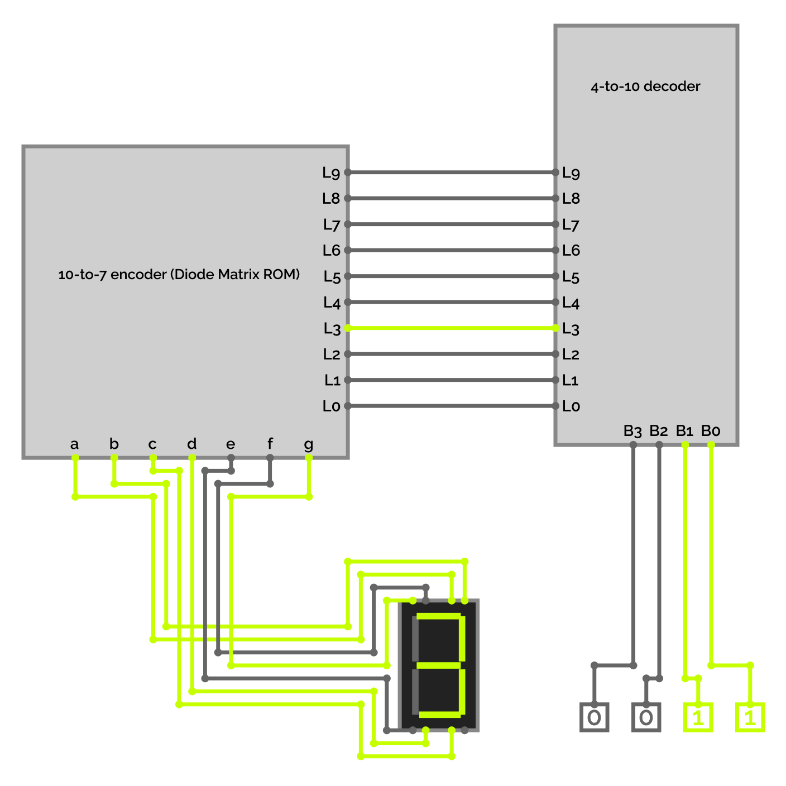
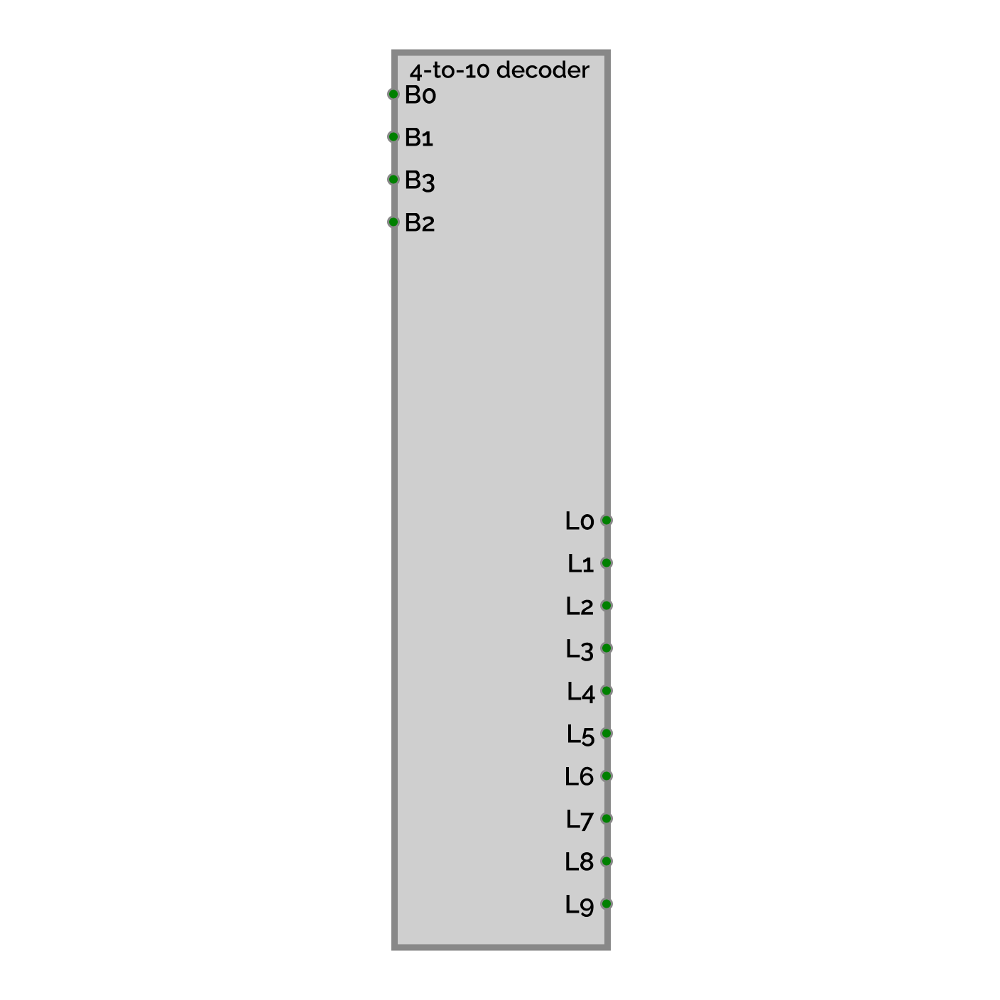

## Interlude II: The Power of Abstraction in Practice – Engineering with Black Boxes (Optional)

---

### A Note from the Instructor

Welcome back, engineer! You just completed Module 3, our first large-scale, multi-part system. You connected a decoder to an encoder to a display, and you saw how breaking a big problem into smaller modules was the key to success.

In the introduction to that module, we talked about the **Power of Abstraction**. Now, it's time to see what that looks like in practice, not just in Minecraft, but in the tools real engineers use. In Lesson 3.2, you saw this image:

*Figure: The digital display system represented with subcircuits in CircuitVerse.*

You probably noticed that the decoder and encoder were shown as simple gray boxes, or **"black boxes,"** instead of the complex web of gates we built. This isn't just to make the diagram look clean; it's a fundamental technique in digital logic design.

In this short, optional interlude, we'll pull back the curtain on how this is done in CircuitVerse. Mastering this skill will make your designs cleaner, easier to manage, and will prepare you for the even more complex circuits we'll build in Part II.

---

### What is a Subcircuit? The "Black Box" Principle

A **subcircuit** is a self-contained circuit that you can package up and treat as a single component. It's the ultimate application of the "black box" principle:

> Once a component is built and tested, you no longer need to worry about *how* it works internally. You only need to know what its inputs and outputs are.

By turning our complex `4-to-10` Decoder into a single subcircuit block, we can hide its internal complexity and focus on how it connects to the rest of the system.

**Why is this so important?**

-   **Clarity**: It makes high-level diagrams incredibly easy to read and understand.
-   **Reusability**: Build a component once (like a 1-bit full adder) and you can reuse it dozens of times without rebuilding it from scratch.
-   **Focus**: It allows you to work on one part of your system without being visually overwhelmed by the others.

---

### The Lab: Using Circuit Tabs as Subcircuits in CircuitVerse

In CircuitVerse, any circuit you build in a separate tab within your project is already a potential subcircuit. Let's package our `4-to-10` Decoder into a clean, reusable component.

#### Step 1: Insert Your Circuit as a Subcircuit

Let's assume you've built your `4-to-10` Decoder in its own circuit tab.

1.  Create a new, blank circuit tab in your project. Name it something like "Main Display Assembly". This will be our canvas.
2.  On the left-hand panel, find the **Circuits** section. You should see all the other tabs from your project listed there.
3.  Click and drag your "4-to-10-Decoder" circuit from this list onto your main canvas.

You will now see your entire decoder collapsed into a single gray block. It's functional, but you'll notice all the input and output pins are in a messy, disorganized cluster. This is not very useful for clean wiring. Let's fix that.

*Figure: The default, disorganized pin layout after inserting a circuit as a subcircuit.*

#### Step 2: Edit the Layout for Clarity

This is the key to professional-looking diagrams. We need to arrange the input and output pins logically.

1.  Click to select the new subcircuit block on your canvas.
2.  On the **Properties Panel** on the right side of the screen, find and click the **Edit Circuit Layout** button.
3.  A new editor window will pop up showing a larger version of your block. On the right, you will now see a **LAYOUT** panel.
4.  **Click and drag** the pins to new positions on the border of the block.
5.  **The Goal**: Arrange your `4` binary inputs (`B3` to `B0`) in a neat row on the left side, and your `10` output lines (`L0` to `L9`) in a neat row on the right. This allows for clean, straight, horizontal wires in your main circuit diagram.
6.  You can also use the **Width** and **Height** controls in the LAYOUT panel to resize the block for a perfect fit.
7.  Click **Save** when you're done.

*Figure: The edited layout with input and output pins neatly organized for clean wiring.*

> **CRITICAL ENGINEERING TIP:**
> As the CircuitVerse documentation advises, you must finalize your circuit layout **before** you start connecting wires to it. If you change the pin layout after wiring, CircuitVerse may break the connections. Do your layout work first!

Now, your subcircuit is not only functional but also a clean, professional component that's easy to integrate. If you repeat this process for your Encoder and 7-Segment Display, you can recreate the exact "black box" diagram we saw at the beginning of this interlude.

---

### Conclusion: Your Engineering Toolkit Grows

You now have a powerful new technique for managing complexity. The ability to create, abstract away, and reuse components is what allows engineers to build incredibly complex systems like a modern CPU, which contains billions of transistors.

As we move into Part II and begin building our Arithmetic Unit, I encourage you to use this subcircuit feature in CircuitVerse to keep your designs organized. It's an optional skill, but one that will greatly enhance your ability to design and troubleshoot the exciting machines to come.
