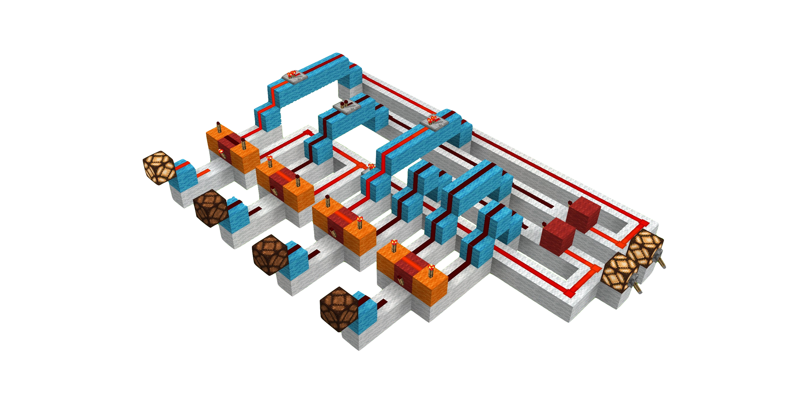

## Module 4: From Binary to Pictures: Building a Digital Display

### Module 4 Summary

-   **Narrative Beat**: We've learned the computer's language. Now, let's build a translator so it can talk back to us. This is our first major engineering project, where we'll turn abstract binary signals into a number we can actually read.
-   **Learning Goals**:
    -   Understand the distinct roles of a decoder and an encoder.
    -   Grasp the engineering trade-offs between a "brute-force" design and an elegant, compact design.
    -   Master "active-low" logic and its practical application in Redstone.
    -   Build a functional Diode Matrix and understand its role as a form of Read-Only Memory (ROM).
-   **Lesson Overview**:
    -   Lesson 4.1: The Goal: Building Our 7-Segment Display
    -   Lesson 4.2: The Master Plan: A Two-Stage Translation
    -   Lesson 4.3: The Decoder Lab: A Simple "Brute-Force" Build
    -   Lesson 4.4: The Decoder Solution: An Elegant, Compact Design
    -   Lesson 4.5: The Encoder: Building a "Diode Matrix" ROM
    -   Lesson 4.6: The Grand Payoff: The Final Connection
-   **Minecraft Artifact**: A working two-stage translator: a 4-to-10 BCD decoder and a 7-segment display encoder, forming a complete digital display system.

---

### Module 4 Introduction

In the previous modules, you learned how to speak to your computer in binary and how to manipulate those signals with logic gates. But a computer that can only listen isn't very satisfying. We want it to talk back! This is our first large-scale engineering project, and with it comes a new way of thinking about building.

> **Our New Rule: The Power of Abstraction**
>
> In **Modules 2 and 3**, we built every gate from scratch to understand how it worked. From this point forward, we will operate at a higher level of abstraction.
>
> When a diagram or instruction says to "Build an AND gate," **how you choose to build it is now up to you.**
>
> -   You can build the verbose, easy-to-read version from the previous modules.
> -   You can use a smaller, more efficient version from the Interlude.
> -   You can design your own!
>
> As long as your component functions according to its truth table, it is a valid build. This freedom is a major step in your journey from student to engineer. The preceding Interlude, **The Art of Compact Design**, gives you the foundation for making these choices.
>
> If you are ever unsure, the verbose builds from the previous modules are guaranteed to work.

---

### Lesson 4.1: The Goal: Building Our 7-Segment Display

> **Key Takeaway**: A 7-segment display is a standard output device that uses seven independent segments to form numbers. Understanding how to control it manually is the first step to controlling it automatically.

*Figure: The symbol for a 7-segment display on CircuitVerse (left) and its function in a basic circuit (right), taking seven inputs and lighting up the segments based on the pattern.*

Our computer can hear us, but it can’t talk back. So far, all our work is invisible, buried in wires and circuits. How do we make our computer show us numbers in a way we understand?

The answer is the **7-segment display**, a classic output device found in everything from digital clocks to microwaves. It uses seven independently controlled segments, labeled `a` through `g`, arranged in an '8' pattern.

*Figure: The standard labeling for the segments of a 7-segment display.*

By lighting up specific combinations of these seven segments, we can display any digit from `0` to `9`.

---

#### Lab: Building the Physical Display

Let’s start by building the physical canvas for our numbers.

1.  **Construct the Segments**: In Minecraft, place Redstone Lamps in the "`8`" shape shown above. For good visibility, making each segment 3 lamps long is a great choice.
2.  **Isolate the Segments**: Carefully surround the lamp segments with a non-conductive block like Wool or Concrete. I use black concrete to make the segments stand out.
3.  **Create Manual Controls**: To power each segment, run a Redstone Repeater into the middle lamp. For now, place a solid block behind each repeater and attach a Lever to it. This gives you manual control for testing.

*Figure: The display's construction stages. From left to right: the basic lamp layout, the layout isolated with concrete, powering the middle lamps of each segment, and a close-up of the repeater and lever used to control a single segment.*

#### Practice Lab: Becoming a Human Encoder

Before we build the complex logic to control this display automatically, let's get a feel for it ourselves. Use the levers you just installed to "draw" the following digits. This exercise will build your intuition for exactly what our machine needs to accomplish.

> **Note**: The levers are on the back of the display, so keep that in mind when flipping specific segments. It might help to label the segments with a sign by the lever that controls it for this exercise.

1.  Flip the levers for segments **`b`** and **`c`**. You should see the digit **`1`**.
2.  Now, try to display the digit **`7`**. (You'll need segments `a`, `b`, and `c`).
3.  Next, create the digit **`4`**. (This requires segments `f`, `g`, `b`, and `c`).
4.  **Challenge**: Try to form the digit **`8`**. What do you notice? Now try to form the digit **`2`**.

---

### Lesson 4.2: The Master Plan: A Two-Stage Translation

> **Key Takeaway**: Complex engineering problems are best solved by breaking them down into smaller, simpler, manageable stages. The "plan" for our encoder is essentially a lookup table.

Now that we have our display, how do we control it? Our computer thinks in 4-bit binary, but our display needs 7 separate signals. Connecting the 4-bit input directly to the 7 segments would be a nightmare.

Instead, let’s think like engineers and break the problem into two much simpler, more manageable stages:

1.  **Decoder**: This first stage will act as an "identifier". Its only job is to look at the 4-bit binary input and determine *which* number (`` `0` ``-`` `9` ``) it represents. It will then activate a single, unique output line corresponding to that number.
2.  **Encoder**: This second stage will act as the "mapper". It receives the simple signal from the decoder (e.g., "the number is `` `3` ``!") and "maps" the signal to the correct combination of the 7 segments.

This modular, two-stage approach is the heart of good engineering. It's easier to build, easier to test, and far easier to fix if something goes wrong.

**Our Signal Flow**:
`[4-bit Input] → [**Decoder**] → [1 of 10 Lines] → [**Encoder/ROM**] → [7 Segment Signals] → [Display]`

*Figure: The overall system in CircuitVerse, using subcircuit abstractions for the decoder, encoder, and display to show the high-level signal flow.*

---

### Lesson 4.3: The Decoder Lab: A Simple "Brute-Force" Build

> **Key Takeaway**: A decoder can be built by assigning one AND gate to recognize each unique binary input. This "brute-force" method is clear but does not scale well.

Before we tackle our full 4-bit to 10-line decoder, let's build a smaller, simpler version to prove the concept. We are going to build a **2-bit to 4-line decoder**. This circuit will take a 2-bit binary input (`00`, `01`, `10`, `11`) and light up one of four corresponding output lamps ($L0$, $L1$, $L2$, $L3$) representing those values in decimal (`0`, `1`, `2`, `3`).

By scaling down the problem, we can focus on the core logic without getting overwhelmed. This is a common engineering practice: start small, prove the concept, then scale up. I'm calling this a "brute-force" method because we will build a separate AND gate for each output, rather than using a more elegant design, which we will learn in the next lesson.

*Figure: The brute-force 2-to-4 decoder in CircuitVerse, using AND gates to recognize each binary pattern.*

#### The Logic on Paper

-   **Inputs**: $B1$ (the "`2`s" place), $B0$ (the "`1`s" place)
-   **Outputs**: $L0$, $L1$, $L2$, $L3$
-   **Logic Gates**: We need one 2-input AND gate for each output.
    -   $L0$ (for `00` or `0`) = $\text{NOT } B1 \text{ AND } \text{NOT } B0$ ($\neg B1 \land \neg B0$)
    -   $L1$ (for `01` or `1`) = $\text{NOT } B1 \text{ AND } B0$ ($\neg B1 \land B0$)
    -   $L2$ (for `10` or `2`) = $B1 \text{ AND } \text{NOT } B0$ ($B1 \land \neg B0$)
    -   $L3$ (for `11` or `3`) = $B1 \text{ AND } B0$ ($B1 \land B0$)

---

#### Lab: Building the 2-to-4 Decoder

**Step 1: The 2-Bit Bus**

1.  Set up two standard inputs using a Redstone Lamp with a lever on one side. Label them $B1$ and $B0$.
2.  From these levers, create a **4-line bus**. For each input, run one line of Redstone dust from the back of the lamp (for the true signal, e.g., $B1$) and another line into a NOT gate (for the inverted signal, e.g., $\neg B1$).
3.  You now have four parallel lines carrying the signals $B1$, $\neg B1$, $B0$, and $\neg B0$. Use colored wool to keep them organized.

*Figure: 4-line bus with inputs $B1$ and $B0$ and their inversions.*

**Step 2: Build and Test the First Gate ($L0$)**

1.  Choose your favorite 2-input AND gate design from **Module 2** or **Interlude I** and build it.
2.  Connect the gate's two inputs to the $\neg B1$ line and the $\neg B0$ line on your bus. Be careful with your wiring!
3.  Place a Redstone Lamp at the output of the AND gate. This is your $L0$ output.
4.  **Test it!** Set your input levers to `` `00` `` ($B1$=OFF, $B0$=OFF). The $L0$ lamp should turn ON. Now, flip either lever. The lamp should turn OFF. This proves your first gate is wired correctly.

*Figure: Single AND gate connected to the $\neg B1$ and $\neg B0$ lines of the bus. The input is set to `` `11` ``, so the $L0$ lamp is OFF. It would be on if the input were `` `00` ``.*

**Step 3: Build the Remaining Gates**

1.  Build three more identical 2-input AND gates next to the first one.
2.  Wire them according to the logic table:
    -   **Gate for $L1$**: Connect its inputs to the $\neg B1$ and $B0$ bus lines.
    -   **Gate for $L2$**: Connect its inputs to the $B1$ and $\neg B0$ bus lines.
    -   **Gate for $L3$**: Connect its inputs to the $B1$ and $B0$ bus lines.
3.  Place a Redstone Lamp on the output of each gate.

**Step 4: The Grand Test**

Now, cycle through all four possible inputs with your levers:

-   `` `00` `` → Only the $L0$ lamp should be ON.
-   `` `01` `` → Only the $L1$ lamp should be ON.
-   `` `10` `` → Only the $L2$ lamp should be ON.
-   `` `11` `` → Only the $L3$ lamp should be ON.

Excellent work! You've built a working decoder.

*Figure: Final working 2-to-4 decoder, with the input set to `` `11` ``, so only the $L3$ lamp is ON.*

#### Lesson Summary: The Problem of Scale

Take a look at the space your 2-to-4 decoder occupies. Now, imagine our real goal: a 4-to-10 decoder. We would need **ten** 4-input AND gates, which are much larger than the simple gates we just used. The brute-force method works, but it does not scale well. It creates a massive, resource-hungry machine.

In the next lesson, we will learn a far more elegant and compact solution.

---

### Lesson 4.4: The Decoder Lab, Part 2: An Elegant, Compact Solution
... (and so on for the rest of the module, applying the same formatting logic) ...
